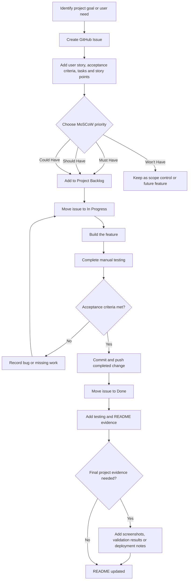
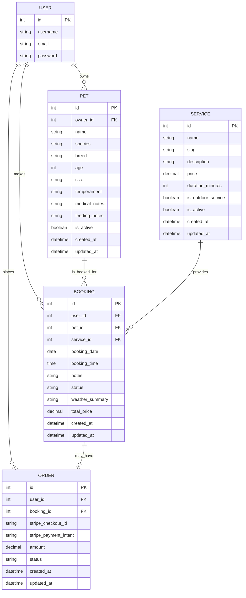

# Walkies & Whiskers


## Introduction

### Project Overview

Walkies & Whiskers is a full stack Django website for a fictional local pet care business. Users can add their pets to the website, record important care details and book an available service, such as dog walking, a drop in visit or pet sitting, for a chosen date and time. They can also view weather guidance for outdoor bookings, pay through Stripe test Checkout and manage their account from a dashboard. Account features include password reset and password change, while automatic emails are sent after registration, password reset requests and successful booking payments.

The main journey through the website is:

1. A visitor views the homepage, About page and available services.
2. The visitor registers for an account or logs in.
3. The user creates a profile for their pet if they haven't already.
4. The user selects a service and creates a booking.
5. The booking form displays the selected service price using JavaScript.
6. Outdoor bookings include weather guidance where available.
7. The booking begins with a Pending Payment status.
8. The user pays through Stripe Checkout.
9. A successful payment changes the booking status to Confirmed.
10. The payment is recorded in the database.
11. A booking confirmation email is generated.
12. The user can view the booking from My Bookings or the dashboard.
13. The user can cancel a booking while the record remains stored for business history.

The Services page and My Pets page use JavaScript modals so users can view more information without leaving the list page. The original detail pages remain available when JavaScript is unavailable.

The project is designed as one website made from several Django applications. Each application manages a clear part of the website, such as accounts, pets, services, bookings and payments.

### Project Purpose

The purpose of Walkies & Whiskers is to give pet owners a simple way to organise pet care online.

Pet care bookings can involve important information about the animal, including feeding instructions, medical needs and temperament. Keeping this information in a pet profile means that users do not need to enter the same information for every booking.

The website also gives the fictional business a clear way to manage its services. The site owner controls service names, descriptions, prices, duration and whether a service is currently active through Django Admin.

The project was planned around one important business rule:

> A booking must not become Confirmed until Stripe has verified that payment was successful.

This rule connects the booking and payment sections of the project.

### Target Audience

The main target audience is pet owners who need to arrange local pet care services.

This may include people who:

* need a dog walking service;
* need somebody to visit their pet during the day;
* need short term pet sitting;
* want to keep important pet care information in one place;
* want to view and manage their own bookings online;
* want clear confirmation that a booking has been paid for.

The website owner is also part of the target audience. The owner needs to manage the business service list, view bookings and inspect payment records through Django Admin.

### Value to Users

Walkies & Whiskers provides value to users by allowing them to:

* browse active pet care services;
* register for a personal account;
* create and manage pet profiles;
* store feeding, temperament and medical information;
* create bookings for pets they own;
* view the agreed service price;
* receive weather guidance for outdoor bookings;
* pay for bookings through Stripe test checkout;
* view the status of each booking;
* reset a forgotten password;
* change their password while logged in;
* receive clear messages after important actions;
* view pet and service details without leaving the list page;
* cancel their own bookings while retaining a clear record.

The website also protects private information by ensuring that users can only view and manage pets and bookings that belong to their own account.

### Business Value

The website supports the fictional business by providing a clear booking and payment process.

The business can:

* advertise active services publicly;
* control service information through Django Admin;
* keep previous service prices attached to existing bookings;
* prevent inactive services from being booked;
* keep a record of payments;
* prevent unpaid bookings from being shown as confirmed;
* view customer, pet, service and booking information through the admin area;
* keep payment records linked to the correct booking.

The Service model is managed by the business rather than regular users. This keeps prices and service information under the control of the site owner.

## Live Website

The deployed website is available at:

[Walkies & Whiskers on Heroku](https://walkies-and-whiskers-9070c4c5aed7.herokuapp.com/)

The deployed application uses PostgreSQL, WhiteNoise, Gunicorn, Gmail SMTP and Stripe test mode.

## Repository

The GitHub repository can be found here:

[Walkies & Whiskers on GitHub](https://github.com/CtrlAltKismet/walkies-and-whiskers)

## Required Technologies

The project uses the following main technologies:

* HTML;
* CSS;
* JavaScript;
* Python and Django;
* SQLite during local development;
* PostgreSQL for the deployed database;
* Stripe for test payments and refund handling;
* WeatherAPI for weather guidance;
* Gmail SMTP for production email delivery;
* Google Fonts for Fraunces, Nunito and Caveat;
* Font Awesome for social media icons;
* Gunicorn as the production web server;
* WhiteNoise for production static files;
* `dj-database-url` for local and production database configuration;
* `psycopg2-binary` for the PostgreSQL connection;
* Git and GitHub for version control and Agile planning;
* Heroku for deployment.

## Table of Contents

* [Introduction](#introduction)
  * [Project Overview](#project-overview)
  * [Project Purpose](#project-purpose)
  * [Target Audience](#target-audience)
  * [Value to Users](#value-to-users)
  * [Business Value](#business-value)
* [Live Website](#live-website)
* [Repository](#repository)
* [Required Technologies](#required-technologies)
* [UX and UI](#ux-and-ui)
  * [Project Goals](#project-goals)
  * [User Goals](#user-goals)
  * [Developer Goals](#developer-goals)
  * [Strategy](#strategy)
  * [User Stories](#user-stories)
  * [Site Structure](#site-structure)
  * [Wireframes](#wireframes)
  * [Design Choices](#design-choices)
  * [Layout and Components](#layout-and-components)
  * [Accessibility Considerations](#accessibility-considerations)
* [Application Architecture](#application-architecture)
  * [Django Project Structure](#django-project-structure)
  * [Django Applications](#django-applications)
  * [URL Structure](#url-structure)
  * [Separation of Concerns](#separation-of-concerns)
  * [Business Logic](#business-logic)
* [Features](#features)
  * [Existing Features](#existing-features)
  * [Service Features](#service-features)
  * [Authentication Features](#authentication-features)
  * [Dashboard Features](#dashboard-features)
  * [Pet Profile Features](#pet-profile-features)
  * [Booking Features](#booking-features)
  * [Payment Features](#payment-features)
  * [Weather API Features](#weather-api-features)
  * [Email Features](#email-features)
  * [User Feedback](#user-feedback)
  * [JavaScript Features](#javascript-features)
* [Mock Ups](#mock-ups)
* [Agile Methodology](#agile-methodology)
  * [Agile Development Process](#agile-development-process)
  * [GitHub Issues](#github-issues)
  * [Project Board](#project-board)
  * [MoSCoW Prioritisation](#moscow-prioritisation)
  * [Story Points](#story-points)
  * [Development Order](#development-order)
  * [Scope Changes During Development](#scope-changes-during-development)
  * [Development Approach and TDD](#development-approach-and-tdd)
* [Database Schema](#database-schema)
  * [Entity Relationship Diagram](#entity-relationship-diagram)
  * [Models](#models)
  * [User Model](#user-model)
  * [Service Model](#service-model)
  * [Pet Model](#pet-model)
  * [Booking Model](#booking-model)
  * [Order Model](#order-model)
  * [Relationships](#relationships)
  * [Data Operations](#data-operations)
  * [Schema Justification](#schema-justification)
* [Tools and Technologies Used](#tools-and-technologies-used)
  * [Languages](#languages)
  * [Frameworks and Libraries](#frameworks-and-libraries)
  * [Database](#database)
  * [External APIs and Services](#external-apis-and-services)
  * [Development Tools](#development-tools)
  * [Version Control](#version-control)
  * [Hosting](#hosting)
* [Installation](#installation)
  * [Prerequisites](#prerequisites)
  * [Clone the Repository](#clone-the-repository)
  * [Create the Virtual Environment](#create-the-virtual-environment)
  * [Install Dependencies](#install-dependencies)
  * [Configure Environment Variables](#configure-environment-variables)
  * [Apply Migrations](#apply-migrations)
  * [Create a Superuser](#create-a-superuser)
  * [Run the Local Server](#run-the-local-server)
* [Deployment](#deployment)
  * [Deployment Platform](#deployment-platform)
  * [Deployment Packages](#deployment-packages)
  * [Heroku Startup Files](#heroku-startup-files)
  * [Production Database](#production-database)
  * [Environment Variables](#environment-variables)
  * [Static Files](#static-files)
  * [Deployment Procedure](#deployment-procedure)
  * [Database Migration](#database-migration)
  * [Initial Service Data](#initial-service-data)
  * [Creating the Production Superuser](#creating-the-production-superuser)
  * [Production Email Configuration](#production-email-configuration)
  * [Testing the Deployed Application](#testing-the-deployed-application)
  * [Forking the Repository](#forking-the-repository)
  * [Cloning the Repository](#cloning-the-repository)
* [Security](#security)
  * [Environment Variables](#environment-variables-1)
  * [Secret Management](#secret-management)
  * [Authentication](#authentication)
  * [Authorisation and Permissions](#authorisation-and-permissions)
  * [Ownership Protection](#ownership-protection)
  * [CSRF Protection](#csrf-protection)
  * [Backend Price Validation](#backend-price-validation)
  * [Stripe Payment Verification](#stripe-payment-verification)
  * [Password Security](#password-security)
  * [User Enumeration Protection](#user-enumeration-protection)
  * [Production Security Settings](#production-security-settings)
* [Future Features](#future-features)
* [Testing](#testing)
  * [Testing Strategy](#testing-strategy)
  * [Manual Testing](#manual-testing)
  * [User Story Testing](#user-story-testing)
  * [CRUD Testing](#crud-testing)
  * [Booking Validation Testing](#booking-validation-testing)
  * [Authentication Testing](#authentication-testing)
  * [Email Testing](#email-testing)
  * [Ownership and Security Testing](#ownership-and-security-testing)
  * [Public and Private Visibility Testing](#public-and-private-visibility-testing)
  * [Stripe Payment Testing](#stripe-payment-testing)
  * [Weather API Testing](#weather-api-testing)
  * [Search and Filter Testing](#search-and-filter-testing)
  * [JavaScript Testing](#javascript-testing)
  * [Responsive Testing](#responsive-testing)
  * [Browser Testing](#browser-testing)
  * [Device Testing](#device-testing)
  * [Deployment Testing](#deployment-testing)
  * [Lighthouse](#lighthouse)
  * [HTML Validation](#html-validation)
  * [CSS Validation](#css-validation)
  * [JavaScript Validation](#javascript-validation)
  * [Python and PEP8 Validation](#python-and-pep8-validation)
  * [Bugs and Fixes](#bugs-and-fixes)
  * [Unfixed Bugs](#unfixed-bugs)
* [Credits](#credits)
  * [Code](#code)
  * [Content](#content)
  * [Media](#media)
  * [Documentation and Learning Resources](#documentation-and-learning-resources)
* [Acknowledgements](#acknowledgements)

## UX and UI

### Project Goals

The main project goals are to:

* create a clear pet care booking website;
* make the purpose of the website understandable to a new visitor;
* allow visitors to view available services;
* allow users to register, log in and log out;
* allow users to create and manage pet profiles;
* allow users to create bookings for their own pets;
* prevent bookings from being created in the past;
* show weather guidance for outdoor services;
* make payment status clear;
* confirm a booking only after successful Stripe payment;
* protect each user’s pets and bookings;
* provide helpful feedback after actions;
* create a website that can be used on different screen sizes;
* deploy the completed project to Heroku;
* document the full development and testing process.

### User Goals

Users should be able to:

* understand the purpose of Walkies & Whiskers from the public pages;
* browse active services without creating an account;
* register with a username, email address and password;
* log in and log out securely;
* reset a forgotten password;
* change their password while logged in;
* create a pet profile;
* view all pets linked to their account;
* view the full details for one of their pets;
* edit their pet’s care information;
* delete a pet profile after confirming the action;
* create a booking using one of their own pets;
* select an active service;
* choose a future date and time;
* view their own bookings;
* open a detailed booking page;
* see whether a booking is waiting for payment or confirmed;
* pay for an eligible pending booking;
* receive useful feedback if payment is successful or cancelled.

### Developer Goals

The developer goals are to:

* build a full stack Django website;
* use a relational database with clear links between records;
* divide the project into logical Django applications;
* create original database models;
* use Django forms with validation;
* include a complete CRUD feature;
* use authentication for a clear reason;
* protect user data through ownership checks;
* connect a weather service;
* include an online payment process;
* keep secret values outside the repository;
* record development through regular Git commits;
* use GitHub Issues and a Project Board;
* test each feature during development;
* document completed work, incomplete work, bugs and fixes honestly.

### Strategy

The main user groups and their needs are:

| User Group | Need |
| --- | --- |
| Visitors | Understand the business and browse active services. |
| Registered pet owners | Create pets, make bookings, pay and manage their own information. |
| Returning users | Log in, view pets and bookings, and recover account access if needed. |
| Site owner | Manage services and inspect bookings and payments through Django Admin. |
| Assessor | Review a working, secure and documented Django project. |

The work was ordered so later features were built on working earlier features.

The development order was:

1. Set up Django and create the project applications.
2. Create the shared layout and public pages.
3. Create the Service model and public service pages.
4. Add registration, login and logout.
5. Add email and password features.
6. Create the Pet model and complete Pet CRUD.
7. Create the Booking model and booking validation.
8. Add weather guidance.
9. Add booking list and detail pages.
10. Connect Stripe Checkout.
11. Add booking confirmation email, dashboard and cancellation.
12. Add pet archiving to protect booking history.
13. Plan the design direction before writing the final CSS.
14. Add the homepage, About page and global scrapbook styling.
15. Add custom JavaScript with non JavaScript fallback routes.
16. Add the favicon, logo and final branding.
17. Complete deployment, live testing and documentation.

### User Stories


The project was planned through GitHub Issues. Each issue includes a user story, acceptance criteria, tasks, story points and a MoSCoW priority.

#### Completed User Story: Set Up Django Project and Applications

As a developer, I want to set up the Django project with separate applications so that the code is organised and follows Django conventions.

**Story Points:** 3  
**Priority:** Must Have  
**Status:** Complete

Completed work includes:

* Django project created;
* six project applications created;
* applications added to Django settings;
* initial migrations applied;
* local server tested;
* repository connected to GitHub.

#### Completed User Story: Create Base Template and Navigation

As a visitor or logged in user, I want a clear navigation menu so that I can move around the website easily.

**Story Points:** 3  
**Priority:** Must Have  
**Status:** Complete

Completed work includes:

* shared `base.html` template;
* different links for visitors and logged in users;
* shared page title and content blocks;
* Django message output;
* POST based logout form with CSRF protection.

Responsive styling was completed during the design stage and was later checked again after deployment.

#### Completed User Story: View Available Services

As a visitor, I want to view available pet care services so that I can choose the service I need.

**Story Points:** 5  
**Priority:** Must Have  
**Status:** Complete

Completed work includes:

* Service model;
* service management through Django Admin;
* public service list;
* active services only;
* name, description, duration and price;
* links to service detail pages;
* testing of active and inactive services.

#### Completed User Story: Register for an Account

As a visitor, I want to create an account so that I can add pets and make bookings.

**Story Points:** 3  
**Priority:** Must Have  
**Status:** Complete

Completed work includes:

* custom registration form;
* email field;
* Django password validation;
* automatic login after registration;
* success message;
* welcome email through the development email system;
* redirect away from registration when already logged in.

#### Completed User Story: Log In and Log Out

As a registered user, I want to log in and log out so that I can securely access my account.

**Story Points:** 3  
**Priority:** Must Have  
**Status:** Complete

Completed work includes:

* login page;
* logout through a POST form;
* success messages;
* invalid login feedback;
* navigation changes based on login status;
* redirect away from login when already logged in.

#### Completed User Story: Reset a Forgotten Password

As a registered user, I want to reset my password by email so that I can regain access to my account.

**Story Points:** 5  
**Priority:** Must Have  
**Status:** Complete

Completed work includes:

* password reset request page;
* secure reset link;
* reset email subject and message templates;
* new password form;
* completed reset page;
* generic response for registered and unregistered email addresses;
* manual testing of the full reset journey.

#### Completed User Story: Change Password While Logged In

As a logged in user, I want to change my password so that I can keep my account secure.

**Story Points:** 3  
**Priority:** Must Have  
**Status:** Complete

Completed work includes:

* password change page;
* login protection;
* old password validation;
* matching password validation;
* normal Django password checks;
* custom validation preventing reuse of the current password;
* success message;
* user remains logged in after a successful change.

#### Completed User Story: Create a Pet Profile

As a logged in user, I want to add a pet profile so that I can book services for my pet.

**Story Points:** 5  
**Priority:** Must Have  
**Status:** Complete

Completed work includes:

* Pet model;
* Pet form;
* required and optional care information;
* automatic owner assignment;
* form validation;
* success message;
* login protection.

#### Completed User Story: Complete Pet Profile CRUD

As a logged in user, I want to create, view, edit and delete my pet profiles so that I can keep their care information accurate.

**Priority:** Must Have  
**Status:** Complete

Completed work includes:

* create pet;
* view pet list;
* view pet detail;
* edit pet;
* delete pet;
* confirmation before deletion;
* ownership protection;
* empty state message;
* testing with two different user accounts.

#### Completed User Story: Create and Validate a Booking

As a logged in user, I want to book a pet care service so that I can arrange care for my pet.

**Story Points:** 8  
**Priority:** Must Have  
**Status:** Complete

Completed work includes:

* Booking model;
* Booking form;
* selection of the user’s own pets only;
* active services only;
* Pending Payment status for new bookings;
* price copied from the selected service;
* past date validation;
* current day time validation;
* field based error messages;
* admin inspection of the saved record.

#### Completed User Story: Display Weather Guidance

As a user booking an outdoor service, I want to see weather guidance so that I understand possible weather related care needs.

**Story Points:** 8  
**Priority:** Must Have  
**Status:** Complete

Weather guidance has been connected to outdoor bookings. The guidance is stored with the booking and displayed on the booking detail page.

The booking journey can continue if the weather service is unavailable. Indoor bookings do not need weather guidance.

The booking view calls `get_weather_guidance(booking.booking_date)` when the selected Service is marked as an outdoor service. 

#### Completed User Story: View My Bookings

As a logged in user, I want to view my bookings so that I can track my pet care arrangements.

**Story Points:** 5  
**Priority:** Must Have  
**Status:** Complete

Completed work includes:

* booking list page;
* bookings filtered by the logged in user;
* date and time ordering;
* visible booking status;
* payment information for pending bookings;
* message when an unpaid booking has passed;
* links to protected booking detail pages.

#### Completed User Story: View Booking Details

As a logged in user, I want to view one booking so that I can check the pet, service, date, time, price and payment status.

**Story Points:** 3  
**Priority:** Must Have  
**Status:** Complete

Completed work includes:

* protected booking detail page;
* pet;
* service;
* booking date;
* booking time;
* notes;
* total price;
* status;
* weather guidance;
* Pay Now form for eligible pending bookings;
* no payment prompt after confirmation.

#### Completed User Story: Start Stripe Checkout

As a logged in user, I want to pay for my pending booking using Stripe so that the booking can be confirmed.

**Story Points:** 8  
**Priority:** Must Have  
**Status:** Complete

Completed work includes:

* checkout application;
* Stripe test mode;
* Stripe keys stored in local environment variables;
* correct amount sent in pence;
* booking ownership and status checks;
* POST only checkout start;
* expired booking protection;
* redirect to Stripe Checkout;
* successful test card payment.

#### Completed User Story: Handle Successful Payment

As a user, I want to see confirmation after successful payment so that I know my booking has been completed.

**Story Points:** 8  
**Priority:** Must Have  
**Status:** Complete

Completed work includes:

* payment success page;
* Stripe Checkout Session verification;
* paid status check;
* payment amount check;
* Order record;
* Stripe Checkout Session ID;
* Stripe Payment Intent ID;
* booking status changed to Confirmed;
* confirmed status shown on booking pages.

#### Completed User Story: Handle Cancelled Payment

As a user, I want helpful feedback if I leave Stripe Checkout so that I understand that my booking has not been confirmed.

**Story Points:** 5  
**Priority:** Must Have  
**Status:** Complete

The booking remains Pending Payment when Stripe Checkout is cancelled. This allows the user to return and try again.

Leaving the payment page does not cancel the booking itself.

#### Completed User Story: User Dashboard

As a logged in user, I want a dashboard so that I can quickly access my pets and bookings.

**Story Points:** 3  
**Priority:** Must Have  
**Status:** Complete

Completed work includes:

* personalised welcome message;
* active pet profile count;
* total booking count;
* pending payment count;
* up to three upcoming confirmed bookings;
* links to My Pets and My Bookings;
* protected access for logged in users only;
* empty state when there are no upcoming confirmed bookings.

#### Completed User Story: Live Booking Price Display

As a user creating a booking, I want the selected service price to appear immediately so that I understand the cost before continuing.

**Story Points:** 5  
**Priority:** Must Have  
**Status:** Complete

Completed work includes:

* service prices passed safely from Django to the template;
* price display updates when the selected service changes;
* default guidance before a service is selected;
* `aria-live="polite"` for the changing price;
* secure backend price calculation remains unchanged;
* browser console test completed;
* JSHint test completed.

The JavaScript price is a preview only. The saved Service price remains the trusted value.

#### Completed User Story: Booking Confirmation Email

As a user, I want to receive an email after successful payment so that I have a record of my confirmed booking.

**Story Points:** 5  
**Priority:** Must Have  
**Status:** Complete

The email is generated after Stripe has verified the payment and the booking is then Confirmed.

The email includes:

* username;
* pet;
* service;
* booking date;
* booking time;
* amount paid;
* booking status.

The email is only sent when a new Order record is created. Refreshing the success page does not generate a duplicate email.

#### Completed User Story: Cancel a Booking

As a logged in user, I want to cancel my own booking so that I can update my plans.

**Priority:** Should Have  
**Status:** Complete

Completed work includes:

* owner protected cancellation page;
* confirmation before cancellation;
* POST based cancellation;
* status changed to Cancelled;
* booking record retained in the database;
* cancellation feedback message;
* protection against cancelling another user’s booking;
* Stripe refund handling in the current build.

#### Completed User Story: Protect Booking History When Removing a Pet

As a user, I want pet removal to protect previous booking records so that my booking and payment history is not lost.

**Priority:** Should Have  
**Status:** Complete

A pet with no booking history can be deleted permanently.

A pet with booking history is archived instead. Archived pets:

* remain in the database;
* disappear from My Pets;
* cannot be used for new bookings;
* keep previous booking history;
* cause upcoming pending and confirmed bookings to be cancelled.

#### Completed User Story: Add Interactive Detail Modals

As a user, I want to view pet and service details without leaving the list page so that the website feels quicker and easier to use.

**Priority:** Should Have  
**Status:** Complete

Completed work includes:

* service details modal;
* pet details modal;
* close button;
* closing by selecting the overlay;
* closing with Escape;
* owner edit and delete links retained in the pet modal;
* service booking or login links shown where appropriate;
* original detail pages retained as fallback links.

#### Completed User Story: Deployment

As a developer, I want to deploy the project so that users and the assessor can access the website.

**Story Points:** 8  
**Priority:** Must Have  
**Status:** Complete

Completed work includes:

* Heroku application created in the Europe region;
* GitHub repository connected to Heroku;
* main branch deployed manually;
* Heroku Postgres added;
* production migrations applied;
* Gunicorn configured through the `Procfile`;
* WhiteNoise configured for static files;
* production environment variables stored in Heroku Config Vars;
* `DEBUG` set to False;
* production allowed host configured;
* initial Service fixture loaded into PostgreSQL;
* production superuser created;
* Gmail SMTP configured using an App Password;
* registration and booking confirmation emails tested;
* Stripe test payment completed on the deployed website;
* repository and Git history checked for exposed secrets.

### Site Structure

Walkies & Whiskers uses a shared `base.html` template. This keeps the main navigation, messages, layout, branding and footer in one place.

Visitors can access:

* Home;
* About;
* Services;
* Service details;
* Register;
* Login;
* Password reset.

Logged in users can access:

* all public pages;
* Dashboard;
* My Pets;
* Add Pet;
* Pet Detail;
* Edit Pet;
* Delete or Archive Pet;
* Create Booking;
* My Bookings;
* Booking Detail;
* Cancel Booking;
* Stripe Checkout;
* Payment Success;
* Payment Cancel;
* Password Change;
* Logout.

The Home page introduces the business through a larger hero area, scrapbook image collage, feature cards, booking steps and account based calls to action.


The About page explains the business purpose, fictional founder, values, service area, contact information, opening hours and social media links.


The Services page displays active services. Selecting a service opens a JavaScript modal containing fuller information. If JavaScript is unavailable, the original service detail page opens normally.


The Dashboard provides a summary of active pets, all bookings, pending payments and upcoming confirmed bookings.


The My Pets page displays active pets belonging to the logged in user. Selecting a pet opens a JavaScript modal. The modal contains the same important information and retains the Edit Pet and Delete Pet links. The original detail page remains available as a fallback.


The Delete Pet page changes depending on the pet’s history. A pet with no bookings can be deleted. A pet with linked bookings is archived so historical records are kept.

Pet with no bookings:


Pet with bookings:


The Create Booking page allows the user to choose one of their active pets, an active service, date, time and optional notes. JavaScript shows the selected service price immediately.


The My Bookings page displays only bookings belonging to the logged in user. The newest booking date and time appear first.

The Booking Detail page displays the full booking, payment status, weather guidance and cancellation option where appropriate.

The Stripe Checkout page is hosted by Stripe. The user returns to either the success page or the payment cancellation page.

### Wireframes

Wireframes were created to help plan the website design prior to coding with CSS. Wireframes were created for the following pages:

* Home page;
* About page;
* Bookings page;
* Dashboard;
* Pets and services pages.

Other than the About page and Home page, most of the website follows the same card based structure to make navigation easier. The design remains professional while allowing users to find the information they need quickly, including when arranging care at short notice.

Home page:


About page:


Bookings page:


Dashboard:


Pets:


Services:


### Design Choices

#### Visual Theme

Walkies & Whiskers uses a warm scrapbook inspired theme.

The design was chosen to make the fictional business feel local, personal and caring without making forms or payment information difficult to use.

The main design principle is:

> Clean structure with handmade decoration.

The visual design uses:

* soft cream backgrounds;
* muted sage green;
* woodland green;
* dusty terracotta;
* warm brown;
* paper style cards;
* gentle shadows;
* faux tape;
* slightly rotated photographs;
* handwritten accent text;
* clear forms and booking information.

#### Colour Palette

The main CSS colours are:

```css
--colour-cream: #f8f2e7;
--colour-paper: #fffaf1;
--colour-paper-dark: #eee2d0;
--colour-sage: #a8b89a;
--colour-sage-light: #d8e1ce;
--colour-moss: #64765d;
--colour-forest: #34483a;
--colour-forest-dark: #243329;
--colour-terracotta: #c98263;
--colour-terracotta-dark: #a86149;
--colour-brown: #725b49;
--colour-charcoal: #30352f;
--colour-muted: #6d746d;
```


Forest green is used for the main navigation and footer. Cream and paper colours keep the content readable. Terracotta is used as an accent for buttons, tape effects and branding.

#### Fonts

The project uses:

* Fraunces for headings;
* Nunito for body text;
* Caveat for handwritten accents.

Fraunces gives the headings a friendly printed appearance. Nunito remains clear for forms and longer text. Caveat is used sparingly so decorative text does not reduce readability.

#### Homepage Design

The hero content appears first, followed by a wide scrapbook photo collage. A smaller image overlaps the lower area, with a handwritten note reading:

```text
Happy pets, happy people
```

The page also uses three feature cards, a three step booking explanation and different calls to action for logged in and logged out users.

#### About Page Design

The About page contains scrapbook photographs, business values, fictional contact details, opening hours and social media icons.

The fictional founder is Claire Rossa. The content remains suitable for a local pet care company and does not rely on placeholder text.

The business details shown on the page are:

| Detail | Information |
| --- | --- |
| Email | `walkieswhiskerscare@gmail.com` |
| Telephone | `01632 960 321` |
| Service area | Coventry and surrounding areas |
| Monday to Friday | 8:00am to 6:00pm |
| Saturday | 9:00am to 4:00pm |
| Sunday | Closed |

The telephone number uses a fictional UK number range. The email address is the dedicated account used by the deployed website to send registration, password reset and booking confirmation emails.

#### Branding

A custom paw favicon is stored at:

```text
static/images/favicon.png
```

A separate terracotta paw logo is stored at:

```text
static/images/logo-paw.png
```

The logo is displayed beside the text name in the main navigation. Its image uses empty alternative text because the nearby text already provides the business name.

The website photographs, favicon and paw logo were created specifically for Walkies & Whiskers using ChatGPT's image generation feature. This avoided the use of third party copyrighted photographs and kept the visual style consistent.

#### Responsive Design

The global stylesheet contains responsive rules for tablet and mobile layouts.

Responsive changes include:

* navigation wrapping;
* card grids becoming single columns;
* forms using the available width;
* image collage changes;
* reduced padding;
* modal width and scrolling controls;
* buttons remaining usable on smaller screens.


### Layout and Components

The website uses:

* a sticky woodland green navigation area;
* a paw logo and text site name;
* a shared message area;
* responsive content containers;
* paper style sections;
* scrapbook cards;
* hero panels;
* styled forms;
* validation messages;
* status information;
* button groups;
* confirmation pages;
* service and pet details modals;
* a woodland green footer;
* social media icons;
* a favicon.

The homepage and About page contain the most decorative image layouts.

Dashboard, booking and payment pages use calmer paper style sections so account information remains easy to scan.

The service and pet modals use one centred overlay pattern. The modal content can scroll when it is taller than the screen. The background page is prevented from scrolling while a modal is open.

The booking price display uses a sage panel with a terracotta border so the selected price is noticeable without looking like an error message.

### Accessibility Considerations

Accessibility work includes:

* semantic headings and page sections;
* standard Django form labels;
* clear form errors;
* visible button and link states;
* readable colour contrast;
* confirmation before destructive actions;
* messages after important actions;
* content that remains available without JavaScript;
* real fallback links for service and pet details;
* `aria-live="polite"` on the live price display;
* `role="dialog"` and `aria-modal="true"` on details modals;
* clear close button labels;
* keyboard closing with Escape;
* focus moved to the close button when a modal opens;
* empty alternative text on the decorative paw logo to avoid repeated screen reader wording;
* reduced motion support in CSS;
* modal content that can scroll on smaller screens;
* status messages that use text rather than colour alone.

The JavaScript does not replace secure Django views. Users can still follow the original service and pet links when scripts do not load.


## Application Architecture

### Django Project Structure

The project uses the following main structure:

```text
walkies_and_whiskers/
    settings.py
    urls.py
    asgi.py
    wsgi.py

home/
accounts/
services/
pets/
bookings/
checkout/

templates/
    base.html

static/
    css/
    js/
    images/

manage.py
requirements.txt
db.sqlite3
```

Django migration folders are included inside applications that contain models.

Templates for each feature are stored inside the related application. The shared base template is stored in the project level templates folder.

### Django Applications

The project contains six custom Django applications.

#### Home

The Home application manages:

* homepage;
* About page;
* public business content;
* scrapbook image layouts;
* contact details and business values;
* custom 404 page.

#### Accounts

The Accounts application manages:

* registration;
* login;
* logout;
* registration email;
* password reset;
* password change;
* dashboard;
* active pet count;
* booking count;
* pending payment count;
* upcoming confirmed booking summary.

#### Services

The Services application manages:

* Service model;
* service list;
* service detail;
* richer service information;
* service details modal;
* non JavaScript service detail fallback;
* service management through Django Admin;
* active and inactive service behaviour.

#### Pets

The Pets application manages:

* Pet model;
* Pet form;
* create pet;
* pet list;
* pet detail;
* edit pet;
* delete pet;
* archive pet;
* active pet filtering;
* pet details modal;
* non JavaScript pet detail fallback;
* pet ownership checks.

#### Bookings

The Bookings application manages:

* Booking model;
* Booking form;
* booking creation;
* booking validation;
* live price data passed to JavaScript;
* weather guidance;
* booking list;
* newest booking ordering;
* booking detail;
* booking cancellation;
* booking ownership checks;
* booking status.

#### Checkout

The Checkout application manages:

* Order model;
* Stripe Checkout Session creation;
* payment verification;
* payment success;
* payment cancellation feedback;
* confirmed booking update;
* payment record storage;
* booking confirmation email;
* duplicate confirmation email protection;
* Stripe refund handling in the current build.

### URL Structure

Each Django application has its own `urls.py` file.

The main project URL file includes the application URL files.

Current route groups include:

```
/
about/
accounts/
services/
pets/
bookings/
checkout/
admin/
```

Examples of current routes include:

```
accounts/register/
accounts/login/
accounts/logout/
accounts/dashboard/
accounts/password-reset/
accounts/password-change/

services/
services/service-slug/

pets/
pets/add/
pets/pet-id/
pets/pet-id/edit/
pets/pet-id/delete/

bookings/
bookings/create/
bookings/booking-id/
bookings/booking-id/cancel/

checkout/booking-id/
checkout/success/
checkout/cancel/booking-id/
```

Service and pet names remain normal links even when JavaScript opens a modal. The original route therefore remains usable when JavaScript is unavailable.

### Separation of Concerns

The project separates different responsibilities into applications and files.

Models store database information.

Forms control user input and validation.

Views manage page behaviour and business rules.

Templates display information to the user.

URL files connect addresses to views.

Admin files control how records appear in Django Admin.

Static files contain CSS, JavaScript, branding assets and project images.

This structure makes the project easier to follow and prevents unrelated features from being placed in one large application.

### Business Logic

The main business rules are:

* new bookings begin as Pending Payment;
* only active services can be booked;
* a user can only book one of their own active pets;
* the booking price is copied from the selected service;
* the JavaScript price is only a preview;
* users cannot choose their own trusted price;
* bookings cannot be created in the past;
* a booking for today must use a future time;
* the newest bookings appear first in My Bookings;
* users can only view their own pets;
* users can only edit, delete or archive their own pets;
* a pet with no booking history can be deleted;
* a pet with booking history is archived;
* archived pets cannot be selected for new bookings;
* archiving a pet cancels upcoming pending and confirmed bookings;
* previous booking history remains stored;
* users can only view and cancel their own bookings;
* booking cancellation changes status instead of deleting the record;
* users can only pay for their own pending bookings;
* only an eligible Pending Payment booking can enter Stripe Checkout;
* a booking cannot enter checkout after its date and time have passed;
* successful payment must be checked with Stripe;
* the amount returned by Stripe must match the stored booking amount;
* only verified payment changes a booking to Confirmed;
* cancelling Stripe Checkout leaves the booking as Pending Payment;
* a confirmation email is only generated for a newly created paid Order;
* refreshing the payment success page does not create a duplicate email;
* regular users cannot manage the service database;
* JavaScript modals do not replace the ownership checks in Django views.

## Features

### Existing Features

The following features are currently working:

* styled homepage;
* styled About page;
* fictional business information;
* contact details and social media links;
* active service list;
* richer service information;
* service detail pages;
* service details modal;
* service management through Django Admin;
* registration;
* login;
* logout;
* welcome email in local and deployed environments;
* password reset;
* password change;
* user dashboard;
* full Pet CRUD;
* pet archive safeguard;
* active pet filtering;
* pet details modal;
* pet ownership protection;
* booking creation;
* booking validation;
* live JavaScript booking price;
* weather guidance;
* booking list with newest first;
* booking detail;
* booking cancellation;
* booking ownership protection;
* Stripe Checkout;
* payment success page;
* payment cancellation page;
* Order records;
* booking confirmation after verified payment;
* booking confirmation email;
* duplicate email protection;
* Stripe refund handling;
* expired booking payment protection;
* Django messages;
* responsive CSS;
* non JavaScript fallback routes;
* custom 404 page;
* favicon;
* paw logo.

### Service Features

The Service model stores the information controlled by the fictional business:

* service name;
* readable slug;
* description;
* price;
* duration in minutes;
* indoor or outdoor status;
* active status;
* creation and update dates.

Django Admin allows the site owner to view the service list, filter by active status and indoor or outdoor status, search by name and description, and generate the slug from the service name.

The initial Service fixture contains:

| Service | Price | Duration | Type |
| --- | ---: | ---: | --- |
| Dog Walking | £15.00 | 60 minutes | Outdoor |
| Drop In Visit | £12.00 | 30 minutes | Indoor |
| Pet Sitting | £25.00 | 120 minutes | Indoor |

Only active services appear on the public Services page and in the Booking form. An inactive service cannot be opened through its public detail route.

The Services page uses a JavaScript modal for quick access to fuller information. The original detail route remains available when JavaScript does not load.

### Authentication Features

Registration uses a custom form based on Django’s account creation form.

The form includes:

* username;
* email address;
* password;
* password confirmation.

After successful registration:

* the account is created;
* the user is logged in;
* a welcome email is created;
* a success message is displayed;
* the user returns to the homepage.

Login and logout use Django authentication. Custom views add success messages.

Logged in users are redirected away from login and registration pages.

Password reset includes:

* email request page;
* secure reset link;
* reset email;
* new password form;
* completion page;
* generic message for all email addresses.

Password change includes a custom check so the new password cannot be the same as the current password.

### Dashboard Features

The protected dashboard gives the logged in user a short account summary.

It displays:

* the current username;
* the number of active pet profiles;
* the total number of bookings;
* the number of bookings awaiting payment;
* up to three upcoming confirmed bookings;
* links to My Pets and My Bookings;
* links to the displayed booking details;
* an empty state when no upcoming confirmed bookings exist.

All dashboard querysets use the current user. Pets, counts and bookings belonging to another account are not included.

### Pet Profile Features

The Pet model stores:

* owner;
* name;
* species;
* breed;
* age;
* size;
* temperament;
* medical notes;
* feeding notes;
* active status;
* created date;
* updated date.

Required information includes:

* name;
* species;
* size;
* temperament;
* feeding notes.

Breed, age and medical notes are optional.

The owner is not included in the user form. The current user is assigned in the view. This prevents a user from assigning a pet to another account.

The Pet form removes unnecessary spaces and checks that useful feeding information has been entered.

Pet CRUD includes:

* create;
* read through list, modal and detail pages;
* update;
* delete or archive.

A pet with no booking history can be deleted permanently.

A pet with booking history is archived instead. The `is_active` field is changed to False. The pet disappears from My Pets and cannot be selected for new bookings. Previous bookings remain stored.

Upcoming pending and confirmed bookings linked to an archived pet are changed to Cancelled. Past bookings remain unchanged.

The My Pets page uses a JavaScript modal for quick viewing. Edit and Delete Pet links remain connected to the original protected Django routes. If JavaScript is unavailable, the pet name opens the original detail page.

### Booking Features

The Booking model stores:

* user;
* pet;
* service;
* date;
* time;
* notes;
* status;
* weather summary;
* total price;
* created date;
* updated date.

The booking form only shows:

* active pets belonging to the current user;
* active services.

The following fields are controlled by the application:

* user;
* status;
* weather summary;
* total price;
* created date;
* updated date.

New bookings begin as Pending Payment.

The booking price is copied from the selected Service record. This means the booking keeps the agreed price even if the Service price changes later.

JavaScript displays the selected service price immediately. The visible value is not trusted for payment.

Past dates are rejected. A booking for today must use a time later than the current time.

The booking list and detail pages only return records belonging to the logged in user.

My Bookings is ordered by descending booking date and time. The newest booking therefore appears first.

Users can open a confirmation page and cancel their own booking. The record remains stored with a Cancelled status instead of being deleted.

### Payment Features

Stripe Checkout is used in test mode.

The payment journey is:

1. The user creates a booking.
2. The booking is saved as Pending Payment.
3. The user opens the booking detail page.
4. The user selects Pay Now.
5. A Stripe Checkout Session is created.
6. Stripe displays the payment page.
7. Successful payment returns the user to the success page.
8. The server retrieves the Checkout Session from Stripe.
9. The paid status and amount are checked.
10. An Order record is created or updated.
11. The booking changes to Confirmed.
12. A confirmation email is generated for the new paid Order.
13. The confirmed booking appears on the booking pages and dashboard.

The Checkout Session includes the booking and user IDs as Stripe metadata.

The amount is created from the stored booking total and converted into pence.

The success page does not trust the browser alone. It retrieves the Checkout Session from Stripe before changing the booking.

If the user leaves Stripe Checkout, the payment cancellation page explains that payment was not completed. The booking remains Pending Payment.

The current build also includes refund handling when a paid booking is cancelled. 

Payment and booking records are kept rather than removed.

### Weather API Features

WeatherAPI has been connected to support outdoor services.

Weather guidance is linked to the booking rather than acting as a live availability system.

The weather feature does the following:

* provide useful information for outdoor care;
* avoid displaying unnecessary guidance for indoor services;
* save the guidance with the booking;
* display the guidance on the booking detail page;
* continue the booking if the weather service is unavailable.

The weather helper is stored in `bookings/weather.py`. It requests a three day forecast for Coventry from WeatherAPI's `forecast.json` endpoint. The response uses the condition text, maximum temperature and daily chance of rain to create pet care guidance. Dates outside the available forecast return a message asking the user to check again closer to the booking. Missing keys, failed requests and unexpected response data return a friendly fallback message without stopping the booking journey.


### Email Features

Local development uses Django’s console email backend. Emails were printed in the VS Code terminal so their recipient, subject, content and dynamic values can be checked without sending real messages during testing. 

The deployed website uses Gmail SMTP through a dedicated Walkies & Whiskers Gmail account.

Completed email features include:

* registration welcome email;
* password reset email;
* booking confirmation email after successful payment.

The registration email includes the username and Walkies & Whiskers wording.


The password reset email includes a secure Django reset link.


The booking confirmation email includes:

* username;
* pet;
* service;
* booking date;
* booking time;
* amount paid;
* booking status.


The confirmation email is protected against duplicates. It is only generated when a new paid Order record is created.

Cancelling or failing payment does not generate a booking confirmation email.

For production, two step verification was enabled on the Gmail account and a Google App Password was created. The normal Gmail password is not used by Django.

The following values are stored in Heroku Config Vars:

```text
EMAIL_HOST_USER
EMAIL_HOST_PASSWORD
```

When these values are present, Django uses the SMTP backend. When they are absent, Django uses the local console backend.

Production tests confirmed that:

* Heroku selected Django’s SMTP backend;
* Gmail accepted the App Password;
* a controlled test email was sent;
* a registration email arrived;
* a booking confirmation email arrived after Stripe payment.

One controlled message arrived in the spam folder. This was recorded as a delivery observation because the application successfully sent and delivered the message.

### User Feedback

Django messages tell users what has happened.

Messages currently include feedback after:

* registration;
* login;
* logout;
* password change;
* pet creation;
* pet editing;
* pet deletion;
* pet archiving;
* booking creation;
* booking cancellation;
* invalid payment access;
* expired booking payment attempt;
* successful payment;
* cancelled payment;
* refund handling where applicable.

Form errors are displayed when submitted information is invalid.

Success, error and information messages are styled through the global CSS.

The payment success and cancellation pages provide clear feedback rather than relying on the booking status alone.

A custom 404 page is also included. It was checked with `DEBUG=False` through a temporary test route and displayed instead of Django's development error page. The test route was removed after the check.

### JavaScript Features

Custom JavaScript is stored in:

```
static/js/booking-price.js
static/js/service-modal.js
static/js/pet-modal.js
```

The scripts improve the user experience but do not replace Django validation, ownership checks or fallback pages.

#### Live Booking Price Display

The booking form receives a service price dictionary from Django.

The values are added to the page safely with:

```
{{ service_prices|json_script:"service-prices" }}
```

When the service selection changes, the page displays:

```
Selected service price: £15.00
```

The display uses `aria-live="polite"`.

The secure backend price is set in the booking view:

```
booking.total_price = booking.service.price
```

#### Service Details Modal

Selecting a service name opens a centred modal containing fuller service information.

The modal includes:

* service description;
* duration;
* price;
* indoor or outdoor status;
* what is included;
* what is not included;
* preparation information;
* booking link for logged in users;
* login link for visitors.

The modal closes through the close button, the overlay or Escape.

The service name remains a real link to the original detail page. If JavaScript does not load, the browser follows that link normally.


#### Pet Details Modal

Selecting a pet name opens a modal containing the full pet profile.

The modal includes the Edit Pet and Delete Pet links. These still use the original protected Django routes.

If JavaScript is unavailable, selecting the pet opens the original pet detail page.


#### Progressive Enhancement

The JavaScript calls `preventDefault()` only after it finds the matching hidden template.

This means the basic page journey remains available without JavaScript.

#### Testing Completed

The live price display and service modal were checked through JSHint with ECMAScript 6 enabled.

The booking price display was tested with the browser console open and no red errors appeared.

The pet modal fallback was tested by temporarily linking to an unavailable script. The pet name then opened the original pet detail route correctly.

## Mock Ups

The following mock ups show how the main pages appear on desktop, tablet and mobile. They were created using [Device Shots](https://deviceshots.com/app).

About Page:


Bookings Page:


Dashboard:


Home Page:


Pets Page:


Services page:


## Agile Methodology

Agile planning was used throughout Walkies & Whiskers to divide the project into smaller and more manageable pieces of work.

The project was planned around the main customer journey:

1. A visitor learns about Walkies & Whiskers.
2. The visitor creates an account or logs in.
3. The user creates a pet profile.
4. The user creates a booking for one of their pets.
5. Outdoor bookings receive weather guidance.
6. The user pays through Stripe Checkout.
7. A successful payment confirms the booking.
8. The user receives a confirmation email.
9. The user can manage pets and bookings through their account.

This customer journey helped decide which features were essential and which ideas could be left outside the first version of the website.

GitHub Issues were used to record user stories, acceptance criteria, tasks, priorities and story points. GitHub Projects was used to move issues through the development process.

### Agile Development Process

The following Mermaid diagram shows how work moved through the Walkies & Whiskers project.



The diagram shows that an issue was not treated as complete simply because code had been written.

Each issue started with a user need or project requirement. The issue was then given acceptance criteria and tasks so that the expected result was clear before development began.

After the feature was built, it was manually tested against its acceptance criteria. If a test failed, the issue stayed open and the problem was fixed before testing again. The issue only moved to Done once the required behaviour worked.

This process was used for authentication, Pet profile management, booking validation, ownership protection, WeatherAPI guidance, Stripe payments, emails, cancellation, refunds, dashboard summaries, JavaScript and responsive styling.

### GitHub Issues

GitHub Issues were used to divide the project into individual pieces of work.

Each main issue included:

* a title;
* a user story;
* acceptance criteria;
* development tasks;
* a MoSCoW priority;
* a story point estimate;
* a development status.

An example issue format used during the project was:

```
As a logged in user, I want to create a pet profile so that I can use my pet when making a booking.
```

The acceptance criteria then described what had to work before the issue could be considered complete.

For the Pet profile issue, the criteria included:

* the form is available to logged in users;
* anonymous visitors are redirected to login;
* valid information creates a Pet profile;
* invalid information displays helpful errors;
* the Pet is linked automatically to the current user.

This made each issue easier to develop and test because the expected result had already been decided.

The project was originally planned with:

| Priority | Number of Issues | Story Points |
| --- | ---: | ---: |
| Must Have | 33 | 156 |
| Should Have | 3 | 10 |
| Could Have | 3 | 13 |
| **Total** | **39** | **179** |

### Project Board

As shown in User Stories, GitHub Projects was used to show the current position of each issue.

| Board Stage | Purpose |
| --- | --- |
| Backlog | Work that had been planned but had not started. |
| In Progress | The issue was currently being developed. |
| Testing | The feature had been built and was being checked against its acceptance criteria. |
| Done | The feature had passed its required tests and was complete. |

Some issues remained open even when part of the work had been completed. For example, a page could have a working view and template but remain In Progress until its content, styling or responsive checks were finished.

This prevented partly completed work from being recorded as complete too early.

Some issues under Could Have and Won't Have remain open with the intention to be future improvements/features for the website.

### MoSCoW Prioritisation

MoSCoW prioritisation was used to control the size of the project.

The priorities were:

* Must Have;
* Should Have;
* Could Have;
* Won't Have.

#### Must Have

Must Have issues covered the main Walkies & Whiskers booking journey and the assessment requirements.

Examples included:

* Django project setup;
* navigation and shared templates;
* public service pages;
* registration, login and logout;
* password reset and password change;
* Pet profile CRUD;
* booking creation and validation;
* ownership protection;
* WeatherAPI guidance;
* Stripe Checkout;
* payment feedback and Order records;
* booking confirmation emails;
* dashboard;
* custom JavaScript;
* responsive styling;
* security;
* deployment;
* testing;
* README documentation.

#### Should Have

Should Have issues were useful improvements that supported the main journey but were not as important as the core booking and payment features.

Several useful improvements were completed once the main features were working, including booking cancellation, Stripe refund handling, Pet archiving and dashboard summary information.

#### Could Have

Could Have issues were optional improvements considered after the main project was stable.

Examples included:

* service details modal;
* Pet details modal;
* richer service information;
* extra front end interaction;
* branding improvements.

Some Could Have work was completed because the main development progressed well. The service and Pet modals were added without removing the original detail pages, so the website still works when JavaScript is unavailable.

#### Won't Have

Won't Have items were deliberately kept outside the project.

These included:

* live calendar availability;
* subscriptions;
* staff accounts;
* staff rota management;
* live chat.

These features would have required more models, permissions, interfaces and testing. They were not needed for the main purpose of Walkies & Whiskers but are noted as future features. 

### Story Points

Story points were used to estimate the size and difficulty of each issue.

They were not intended to represent exact hours.

| Story Points | Meaning |
| ---: | --- |
| 1 | A very small task with little risk. |
| 2 | A small task involving limited changes. |
| 3 | A medium task involving a view, template or simple account behaviour. |
| 5 | A larger task involving forms, permissions or several files. |
| 8 | A complex task involving payments, an external service, deployment, security or larger documentation work. |

Examples from Walkies & Whiskers include:

| Example Issue | Points | Reason |
| --- | ---: | --- |
| Create the About page | 1 | A small public page using an existing layout. |
| Create the dashboard | 3 | Required a protected view, database counts, a template and links. |
| Create a Pet profile | 5 | Required a model, form, validation, view, template, permissions and testing. |
| Add Stripe Checkout | 8 | Required an external payment service, security checks, Order records and several payment outcomes. |
| Deploy the project | 8 | Requires production settings, PostgreSQL, environment variables, static files and live testing. |

### Development Order

1. Set up Django and the six project applications.
2. Create the shared template and navigation.
3. Create the Home and About pages.
4. Create the Service model and service pages.
5. Add registration, login and logout.
6. Add registration email, password reset and password change.
7. Create the Pet model and complete Pet profile CRUD.
8. Create the Booking model and booking form.
9. Add booking validation and ownership protection.
10. Add WeatherAPI guidance.
11. Create booking list and detail pages.
12. Add Stripe Checkout and Order records.
13. Verify successful and cancelled payment journeys.
14. Send booking confirmation emails.
15. Create the dashboard.
16. Add booking cancellation and refunds.
17. Add Pet archive protection.
18. Create the visual design and responsive styling.
19. Add custom JavaScript.
20. Add the favicon and paw logo.
21. Prepare for deployment, live testing and documentation.

This order meant later work was built on features that already existed.

For example, the dashboard was postponed until Pet and Booking records were available. This allowed it to use real counts and upcoming bookings instead of placeholder content.

### Scope Changes During Development

#### Dashboard Postponed Until Real Data Existed

The dashboard was originally planned earlier in the project.

It was postponed until the Pet and Booking models and list pages were complete. This allowed the dashboard to use real pet counts, booking counts and upcoming booking data instead of temporary placeholder content.

#### Pet Deletion Changed to Archiving

The first Pet CRUD plan allowed a Pet to be deleted.

During development, it became clear that deleting a Pet with booking history could remove or affect important booking records.

The final rule is:

* a Pet with no booking history can be deleted;
* a Pet with booking history is archived;
* archived Pets no longer appear in normal lists or booking forms;
* previous booking records remain available;
* future active bookings for the archived Pet are cancelled.

#### Booking Cancellation Kept the Record

Bookings are not deleted when cancelled.

The status changes to Cancelled so booking and payment history remain available. This is especially important for paid bookings and refund records.

#### JavaScript Used as an Enhancement

The price display and detail modals were designed as enhancements.

The booking form still saves the real price in Python. The service and Pet detail links remain normal links if JavaScript is unavailable.

This means the main website journeys do not depend on JavaScript.

#### Optional Work Added Only After Main Features Worked

The service modal, Pet modal, richer service information, favicon and paw logo were added after the core booking and payment features were already working.

This kept the project focused on the main requirements before adding smaller improvements.

### Development Approach and TDD

The project did not use Test Driven Development consistently throughout.

Walkies & Whiskers was developed incrementally using GitHub Issues, acceptance criteria and manual testing. Features were implemented first, then checked against their acceptance criteria before the related issue was moved to Done.

Manual testing was used more than TDD from a user perspective; though this took more time, the user experience was prioritised and bugs seemed easier to find when testing the website.

## Database Schema

Walkies & Whiskers uses a relational database.

The main records are:

* Django User;
* Service;
* Pet;
* Booking;
* Order.

### Entity Relationship Diagram



The Entity Relationship Diagram shows the main database structure used in Walkies & Whiskers.

The application uses Django's built in User model alongside four project models: Service, Pet, Booking, and Order.

The relationships are:

* one User can own many Pets;
* one User can create many Bookings;
* one User can have many Orders;
* one Pet can appear in many Bookings;
* one Service can appear in many Bookings;
* one Booking can have zero or one Order, while each Order belongs to one Booking.

This structure supports the main booking journey while keeping ownership and payment records clearly linked.

### Models

Walkies & Whiskers uses Django’s built in User model alongside four custom models created specifically for the project.

The models are:

* User;
* Service;
* Pet;
* Booking;
* Order.

Each model has a separate purpose within the booking journey.

| Model | Purpose |
| --- | --- |
| User | Stores account and authentication information for registered users. |
| Service | Stores the pet care services offered by Walkies & Whiskers. |
| Pet | Stores pet profiles and care information belonging to registered users. |
| Booking | Connects a user, pet and service to a chosen date and time. |
| Order | Stores Stripe payment information linked to a booking. |

Django’s existing User model was used rather than creating a separate account model. It already provides the username, email address, protected password storage and authentication features needed by the project.

The User model is also used to establish ownership. Pet profiles, bookings and payment records are linked to the user who created them. This allows the application to filter private information and prevent one user from viewing or changing another user’s records.

The Service model represents the services offered by the fictional business. Service records are managed through Django Admin rather than by regular users. This allows the business owner to control service names, descriptions, prices, duration, availability and whether weather guidance is required.

The Pet model stores the care information needed when arranging a service. This includes the pet’s species, size, temperament, feeding instructions and optional medical notes. Each Pet belongs to one User. The model also contains an active status so pets with booking history can be archived rather than removed from the database.

The Booking model is the central model within the customer journey. It links one User, one Pet and one Service. It also stores the requested date and time, booking notes, weather guidance, agreed price and current status.

New bookings begin with a Pending Payment status. The booking only changes to Confirmed after Stripe has verified that payment was successful. Cancelled bookings remain stored so the business retains an accurate booking history.

The Order model stores the payment record created through Stripe Checkout. Each Order is linked to one User and one Booking. It stores the amount paid, payment status, Stripe Checkout Session ID and Stripe Payment Intent ID.

Keeping Booking and Order as separate models allows booking information and payment information to be managed independently. It also means the project can retain a clear record of what was booked and how the payment was processed.

The four custom models are:

* Service;
* Pet;
* Booking;
* Order.

Together, these models support the full Walkies & Whiskers journey from creating a pet profile through to arranging, paying for and managing a booking.

### User Model

Django’s built in User model is used for accounts and authentication.

Important fields used by the project include:

* id;
* username;
* email;
* password.

The password is not stored as readable text. Django stores a protected password value.

The User model is linked to:

* Pet through the owner field;
* Booking through the user field;
* Order through the user field.

### Service Model

The Service model stores the pet care services offered by the business.

| Field | Type | Purpose |
| --- | --- | --- |
| `name` | CharField | Service name. |
| `slug` | SlugField | Readable value used in the service URL. |
| `description` | TextField | Full service information. |
| `price` | DecimalField | Service cost. |
| `duration_minutes` | PositiveIntegerField | Service length. |
| `is_outdoor_service` | BooleanField | Marks services that need weather guidance. |
| `is_active` | BooleanField | Controls whether the service is publicly available. |
| `created_at` | DateTimeField | Creation date. |
| `updated_at` | DateTimeField | Last update date. |

Services are ordered alphabetically.

The slug creates readable URLs such as:

```
services/dog-walking/
```

Only active services appear on public pages and booking forms.

### Pet Model

The Pet model stores care information for a user’s pet.

| Field | Type | Purpose |
| --- | --- | --- |
| `owner` | ForeignKey | Links the pet to its user. |
| `name` | CharField | Pet name. |
| `species` | CharField | Animal type. |
| `breed` | CharField | Optional breed. |
| `age` | PositiveSmallIntegerField | Optional age. |
| `size` | CharField with choices | Small, medium or large. |
| `temperament` | TextField | Behaviour and temperament information. |
| `medical_notes` | TextField | Optional health or care notes. |
| `feeding_notes` | TextField | Required feeding instructions. |
| `is_active` | BooleanField | Controls whether the pet appears in normal lists and booking forms. |
| `created_at` | DateTimeField | Creation date. |
| `updated_at` | DateTimeField | Last update date. |

Pets are ordered by name.

Each pet belongs to one user.

If a pet has no booking history, the owner can delete it.

If a pet has booking history, it is archived by changing `is_active` to False. This protects related booking and payment records.

### Booking Model

The Booking model stores a request for pet care.

| Field | Type | Purpose |
| --- | --- | --- |
| `user` | ForeignKey | Links the booking to its user. |
| `pet` | ForeignKey | Links the booking to one pet. |
| `service` | ForeignKey | Links the booking to one service. |
| `booking_date` | DateField | Requested date. |
| `booking_time` | TimeField | Requested time. |
| `notes` | TextField | Optional booking notes. |
| `status` | CharField with choices | Pending Payment, Confirmed or Cancelled. |
| `weather_summary` | TextField | Weather guidance where needed. |
| `total_price` | DecimalField | Agreed service price. |
| `created_at` | DateTimeField | Creation date. |
| `updated_at` | DateTimeField | Last update date. |

Bookings are ordered by date and time.

The Service relationship uses `PROTECT`. This means a service cannot be deleted while booking records depend on it.

A service can be made inactive instead.

### Order Model

The Order model stores Stripe payment details.

| Field | Type | Purpose |
| --- | --- | --- |
| `user` | ForeignKey | Links the payment to the user. |
| `booking` | OneToOneField | Links one payment record to one booking. |
| `stripe_checkout_id` | CharField | Stores the unique Stripe Checkout Session ID. |
| `stripe_payment_intent` | CharField | Stores the Stripe Payment Intent ID where available. |
| `amount` | DecimalField | Amount paid. |
| `status` | CharField with choices | Paid, Pending or Failed. |
| `created_at` | DateTimeField | Creation date. |
| `updated_at` | DateTimeField | Last update date. |

The Order model uses `PROTECT` for important payment relationships so payment history cannot be removed accidentally through related record deletion.

Order records are ordered with the newest first.

### Relationships

#### User to Pet

One user can own many pets.

Each pet belongs to one user.

```
User one to many Pet
```

#### User to Booking

One user can create many bookings.

Each booking belongs to one user.

```
User one to many Booking
```

#### User to Order

One user can have many Order records.

Each Order belongs to one user.

```
User one to many Order
```

#### Pet to Booking

One pet can be used in many bookings.

Each booking contains one pet.

```
Pet one to many Booking
```

#### Service to Booking

One service can appear in many bookings.

Each booking contains one service.

```
Service one to many Booking
```

#### Booking to Order

One booking can have zero or one Order record because an Order is only created after a payment has been verified.

Each Order belongs to exactly one booking.

```text
Booking one to zero or one Order
```

### Data Operations

#### Pet CRUD

Create:

* user completes the Pet form;
* owner is assigned from the logged in user;
* pet is saved as active.

Read:

* My Pets shows active pets owned by the current user;
* selecting a pet opens the details modal;
* Pet Detail remains available as a fallback route.

Update:

* owner opens the edit page;
* current data fills the form;
* valid changes are saved.

Delete or archive:

* owner opens a confirmation page;
* a pet with no booking history can be deleted;
* a pet with booking history is archived;
* archived pets disappear from My Pets and new booking forms;
* upcoming bookings for the archived pet are cancelled;
* previous booking history remains stored.

#### Booking Operations

Create:

* user selects one of their own active pets;
* user selects an active service;
* date and time are checked;
* booking is saved as Pending Payment;
* price is copied from the Service record;
* JavaScript displays the selected price as a preview.

Read:

* My Bookings shows bookings belonging to the current user;
* bookings are ordered with the newest date and time first;
* Booking Detail shows one booking belonging to the current user.

Payment update:

* Stripe payment is checked;
* an Order is created or updated;
* booking status becomes Confirmed;
* one confirmation email is generated for a new paid Order.

Cancel:

* the owner opens a confirmation page;
* the booking status becomes Cancelled;
* the booking record remains stored;
* refund handling is used for paid bookings in the current build.

### Schema Justification

The schema follows the natural structure of the pet care booking process.

A user owns pets.

A user creates bookings.

A booking connects one user, one pet and one service.

A successful payment creates an Order linked to the booking.

The Service price is copied into the Booking record. This protects the agreed price if the business changes the Service price later.

The Order is kept separate from the Booking because booking information and payment information have different purposes.

The one to one link between Booking and Order prevents several paid Order records being attached to one booking.

The Service model is controlled by the business. Regular users can view services and create bookings, but cannot edit service data.

## Tools and Technologies Used

### Languages

| Language | Purpose |
| --- | --- |
| HTML | Django template structure. |
| CSS | Scrapbook inspired styling, responsive layouts, modals and accessibility support. |
| JavaScript | Live booking price display and interactive pet and service details modals. |
| Python | Application logic, forms, models, views and external service handling. |
| SQL | Database storage through Django. |

### Frameworks and Libraries

| Tool | Purpose |
| --- | --- |
| Django 5.2.16 | Main web framework. |
| `python-dotenv` | Loads local environment variables from `.env`. |
| Stripe Python package | Connects Stripe Checkout, payment verification and refunds. |
| Gunicorn | Runs the Django application on Heroku. |
| WhiteNoise | Serves production static files. |
| dj-database-url | Selects SQLite locally and PostgreSQL through `DATABASE_URL` in production. |
| psycopg2-binary | Provides the PostgreSQL database connection. |
| Google Fonts | Loads Fraunces, Nunito and Caveat. |
| Font Awesome | Displays social media icons on the About page. |
| ChatGPT | Created the original project photographs and branding assets. |
| CI Python Linter | Test PEP8 code. |

The exact package versions are recorded in `requirements.txt`.

### Database

SQLite is used during local development.

Heroku Postgres is used by the deployed application.

The database settings use `dj-database-url`. When `DATABASE_URL` is not present, Django uses the local SQLite database. Heroku supplies `DATABASE_URL` for PostgreSQL.

Django migrations manage changes to the database structure.

### External APIs and Services

#### Stripe

Stripe is used in test mode for online payment and refund testing.

Stripe Checkout provides the hosted payment page.

The project retrieves the returned Checkout Session from Stripe and verifies its status and amount before confirming a booking.

The deployed payment journey was tested using Stripe’s standard successful test card:

```
4242 4242 4242 4242
```

No real payment card is required.

#### WeatherAPI

WeatherAPI provides guidance for outdoor bookings.

The API key is stored in environment variables. Failure of the weather service does not stop the booking journey.

#### Email

Django’s console email backend is used locally.

Gmail SMTP is used by the deployed website when `EMAIL_HOST_USER` and `EMAIL_HOST_PASSWORD` are available in Heroku Config Vars.

The Gmail account uses two step verification and a Google App Password.

#### Heroku

Heroku hosts the deployed application in the Europe region.

Heroku Postgres stores production data and Heroku Config Vars protect production settings.

### Development Tools

The project has been developed using:

* Visual Studio Code;
* PowerShell;
* Python virtual environment;
* Django development server;
* Django Admin;
* browser developer tools;
* browser console;
* Pylance;
* JSHint;
* Git.

Recorded local versions include:

* Python 3.14.5;
* Django 5.2.16;
* Git 2.54.0;
* Visual Studio Code 1.125.1.

### Version Control

Git is used for version control.

GitHub is used for:

* remote repository;
* commit history;
* Issues;
* Project Board;
* feature planning;
* bug tracking;
* documentation evidence;
* Heroku deployment integration.

Commits have been kept focused on individual features and fixes where possible.

### Hosting

The website is deployed to Heroku.

Production uses:

* Gunicorn;
* WhiteNoise;
* Heroku Postgres;
* Heroku Config Vars;
* Gmail SMTP;
* Stripe test mode.

## Installation

### Prerequisites

To run the project locally, you need:

* Python;
* Git;
* VS Code;
* a Stripe test account for payment testing;
* a WeatherAPI key;
* the project environment variables.

The project was developed using Python 3.14.5.

### Clone the Repository

Clone the repository using:

```bash
git clone https://github.com/CtrlAltKismet/walkies-and-whiskers.git
```

Open the project folder:

```bash
cd walkies-and-whiskers
```

### Create the Virtual Environment

Create a virtual environment:

```powershell
py -3.14 -m venv .venv
```

Activate it in Windows PowerShell:

```powershell
.\.venv\Scripts\Activate.ps1
```

The terminal should display:

```text
(.venv)
```

### Install Dependencies

Install the project dependencies:

```powershell
pip install -r requirements.txt
```

### Configure Environment Variables

Create a local `.env` file in the main project folder.

The project will require values similar to:

```text
SECRET_KEY=your_local_key
DEBUG=True
ALLOWED_HOSTS=127.0.0.1,localhost
STRIPE_PUBLIC_KEY=stripe_test_public_key
STRIPE_SECRET_KEY=stripe_test_secret_key
WEATHER_API_KEY=a_weather_api_key
DATABASE_URL=key_for_postgresql
EMAIL_HOST_USER=key_for_testing_smtp_locally
EMAIL_HOST_PASSWORD=key_for_testing_smtp_locally
```

These variable names match the environment variables used in `settings.py`.

Do not commit the `.env` file.

### Apply Migrations

Run database migrations:

```powershell
python manage.py migrate
```

When model changes are made during development:

```powershell
python manage.py makemigrations
python manage.py migrate
```

### Create a Superuser

Create an admin user:

```powershell
python manage.py createsuperuser
```

Follow the terminal instructions.

The superuser can then open:

```text
http://127.0.0.1:8000/admin/
```

### Run the Local Server

Start the development server:

```powershell
python manage.py runserver
```

Open:

```
http://127.0.0.1:8000/
```

## Deployment

### Deployment Platform

Walkies & Whiskers is deployed to Heroku through GitHub integration.

App name:

```text
walkies-and-whiskers
```

Live website:

```text
https://walkies-and-whiskers-9070c4c5aed7.herokuapp.com/
```

The Heroku application uses the Europe region.

### Deployment Packages

The following packages were installed for deployment:

```powershell
pip install gunicorn whitenoise psycopg2-binary dj-database-url
pip freeze > requirements.txt
```

Their purposes are:

| Package | Purpose |
| --- | --- |
| Gunicorn | Production web server. |
| WhiteNoise | Production static file handling. |
| psycopg2-binary | PostgreSQL connection. |
| dj-database-url | Database configuration from `DATABASE_URL`. |

### Heroku Startup Files

The root `Procfile` contains:

```
web: gunicorn walkies_and_whiskers.wsgi
```

The root `.python-version` file contains:

```
3.14
```

### Production Database

Heroku Postgres is used for the production database.

The Essential 0 database plan was added through the Heroku Resources tab.

Heroku created the managed `DATABASE_URL` value automatically.

The Django database setting is:

```python
DATABASES = {
    "default": dj_database_url.config(
        default=f"sqlite:///{BASE_DIR / 'db.sqlite3'}",
        conn_max_age=600,
        conn_health_checks=True,
    )
}
```

This means:

* local development uses SQLite;
* Heroku uses PostgreSQL.

### Environment Variables

Secret and environment specific values are stored in Heroku Config Vars.

The deployed project uses:

```text
DATABASE_URL
SECRET_KEY
DEBUG
ALLOWED_HOSTS
WEATHER_API_KEY
STRIPE_PUBLIC_KEY
STRIPE_SECRET_KEY
EMAIL_HOST_USER
EMAIL_HOST_PASSWORD
```

Production uses:

```text
DEBUG=False
```

The Heroku hostname is included in `ALLOWED_HOSTS`.

Real values are not included in this README or committed to GitHub.

### Static Files

WhiteNoise serves static assets in production.

WhiteNoise middleware is placed directly after Django Security Middleware:

```python
MIDDLEWARE = [
    "django.middleware.security.SecurityMiddleware",
    "whitenoise.middleware.WhiteNoiseMiddleware",
    ...
]
```

Static file settings include:

```python
STATIC_URL = "/static/"

STATICFILES_DIRS = [
    BASE_DIR / "static",
]

STATIC_ROOT = BASE_DIR / "staticfiles"
```

Production static storage uses:

```python
STORAGES = {
    "default": {
        "BACKEND": (
            "django.core.files.storage.FileSystemStorage"
        ),
    },
    "staticfiles": {
        "BACKEND": (
            "whitenoise.storage."
            "CompressedManifestStaticFilesStorage"
        ),
    },
}
```

The static collection command completed successfully:

```powershell
python manage.py collectstatic --noinput
```

The generated `staticfiles` directory is ignored by Git.

### Deployment Procedure

The completed deployment process was:

1. Install Gunicorn, WhiteNoise, `psycopg2-binary` and `dj-database-url`.
2. Update `requirements.txt`.
3. Move environment specific settings into environment variables.
4. Configure WhiteNoise.
5. Configure local SQLite and production PostgreSQL through `dj-database-url`.
6. Create the `Procfile`.
7. Create `.python-version`.
8. Run `collectstatic`.
9. Run `python manage.py check`.
10. Commit and push the deployment changes.
11. Create the Heroku application in the Europe region.
12. Add Heroku Postgres.
13. Add the required Config Vars.
14. Connect Heroku to the GitHub repository.
15. Select the `main` branch.
16. Deploy manually.
17. Run production migrations.
18. Load the initial Service fixture.
19. Create the production superuser.
20. Configure Gmail SMTP.
21. Redeploy the updated settings.
22. Test the live website, email and Stripe Checkout.

### Database Migration

The first deployed Services page returned a server error because the production database tables did not exist.

The following command was run through the Heroku console:

```text
python manage.py migrate
```

After migration, the Services page loaded correctly.

### Initial Service Data

The local Service records were stored in SQLite and did not move automatically to PostgreSQL.

A Django fixture was created:

```powershell
New-Item -ItemType Directory -Force services\fixtures

python manage.py dumpdata services.Service --indent 2 --output services/fixtures/services.json
```

The fixture contains:

* Dog Walking;
* Pet Sitting;
* Drop In Visit.

After redeployment, the fixture was loaded through the Heroku console:

```text
python manage.py loaddata services
```

All three active services then appeared on the deployed Services page.

### Creating the Production Superuser

A production superuser was created through the Heroku console:

```text
python manage.py createsuperuser
```

The deployed Django Admin was tested successfully.

### Production Email Configuration

Local development continues to use Django’s console email backend.

Heroku uses Gmail SMTP when the production email Config Vars are present:

```python
EMAIL_HOST_USER = os.getenv("EMAIL_HOST_USER")
EMAIL_HOST_PASSWORD = os.getenv("EMAIL_HOST_PASSWORD")

if EMAIL_HOST_USER and EMAIL_HOST_PASSWORD:
    EMAIL_BACKEND = (
        "django.core.mail.backends.smtp.EmailBackend"
    )
    EMAIL_HOST = "smtp.gmail.com"
    EMAIL_PORT = 587
    EMAIL_USE_TLS = True
    EMAIL_TIMEOUT = 20

    DEFAULT_FROM_EMAIL = (
        f"Walkies & Whiskers <{EMAIL_HOST_USER}>"
    )
else:
    EMAIL_BACKEND = (
        "django.core.mail.backends.console.EmailBackend"
    )

    DEFAULT_FROM_EMAIL = (
        "Walkies & Whiskers "
        "<noreply@walkiesandwhiskers.com>"
    )
```

A dedicated Gmail account was created for the fictional business:

```text
walkieswhiskerscare@gmail.com
```

two step verification was enabled and a Google App Password was generated. The normal Gmail password was not used.

The Heroku console confirmed the selected backend:

```text
django.core.mail.backends.smtp.EmailBackend
```

A controlled test email returned:

```text
1
```

The email arrived successfully. It first appeared in the spam folder, which was recorded as a delivery observation rather than an application error.

A fresh registration email and an automatic booking confirmation email were also received successfully.

### Testing the Deployed Application

Completed production checks include:

* Heroku website loads;
* PostgreSQL database connected;
* migrations applied;
* static CSS, JavaScript and images load;
* initial Service fixture loaded;
* production superuser works;
* Django Admin loads;
* Services page displays active records;
* registration works;
* production registration email arrives;
* Stripe Checkout opens in test mode;
* test payment succeeds;
* booking becomes Confirmed;
* automatic booking confirmation email arrives;
* `DEBUG` is False;
* Heroku hostname is accepted;
* repository and Git history contain no exposed secret files.

Browser, device, fallback, cancellation and refund checks are recorded in the Testing section.

### Forking the Repository

To create a copy of the repository through GitHub:

1. Log in to GitHub.
2. Open the project repository.
3. Select Fork.
4. Choose the account where the fork should be created.
5. Wait for GitHub to create the copy.

### Cloning the Repository

To download a local copy:

1. Open the project repository.
2. Select Code.
3. Copy the HTTPS address.
4. Open a terminal.
5. Run:

```bash
git clone https://github.com/CtrlAltKismet/walkies-and-whiskers.git
```

6. Open the downloaded project folder.

## Security

### Environment Variables

Environment variables are used for:

* Django secret key;
* Stripe keys;
* WeatherAPI key;
* database connection;
* production email details;
* `DEBUG`;
* allowed hosts.

Local values are stored in `.env`.

Production values are stored in Heroku Config Vars.

The local and production Django secret keys are separate.

### Secret Management

The `.gitignore` file excludes:

```text
.venv/
venv/
__pycache__/
*.py[cod]
db.sqlite3
staticfiles/
.env
.DS_Store
Thumbs.db
```

The following checks were completed:

```powershell
git ls-files .env db.sqlite3
git log --all -- .env
git log --all -- db.sqlite3
git log --all -- venv .venv
git rev-list --objects --all
```

The repository was also searched manually for secret setting names and common key prefixes.

Confirmed:

* `.env` is not tracked;
* `db.sqlite3` is not tracked;
* virtual environments are not tracked;
* generated static files are not tracked;
* these files did not appear in Git history;
* no actual secret values were found in GitHub;
* GitHub displayed no secret scanning alerts;
* Heroku production secrets are stored in Config Vars;
* Gmail uses a Google App Password rather than the normal account password.

### Authentication

Django authentication manages:

* registration;
* login;
* logout;
* password reset;
* password change.

Private views use login protection.

Login and registration pages redirect users who are already logged in.

### Authorisation and Permissions

Permissions are based on the logged in user and record ownership.

Regular users cannot:

* access Django Admin;
* manage the Service database;
* view another user’s private pet information;
* edit another user’s pet;
* delete or archive another user’s pet;
* view another user’s bookings;
* cancel another user’s booking;
* pay for another user’s booking;
* confirm a booking without payment.

Admin users can manage Services, Pets, Bookings and Orders through Django Admin.

### Ownership Protection

Pet detail, edit and removal views include the current user in the database lookup.

Booking list, detail and cancellation views filter by the current user.

Checkout also checks the current user, booking status and booking ID.

Unauthorised access returns a safe 404 or redirects to login.

Testing has been completed with at least two local user accounts.

### CSRF Protection

POST forms include Django’s CSRF token.

This includes:

* registration;
* logout;
* pet creation;
* pet editing;
* pet deletion or archiving;
* booking creation;
* booking cancellation;
* Stripe Checkout start.

Pet deletion, archiving and booking cancellation only happen through POST.

Stripe Checkout only begins through the Pay Now POST form.

### Backend Price Validation

The booking form does not allow the user to enter a trusted price.

The price is copied from the selected Service in the booking view:

```python
booking.total_price = booking.service.price
```

JavaScript only displays a preview.

Stripe uses the saved Booking price.

The payment success view checks that the amount returned by Stripe matches the Booking amount.

### Stripe Payment Verification

A booking is not confirmed simply because the user visits a success address.

The payment success view:

* requires a Checkout Session ID;
* retrieves the Session from Stripe;
* checks that payment status is paid;
* reads the booking ID from Stripe metadata;
* checks that the booking belongs to the current user;
* checks the total amount;
* creates or updates the Order;
* changes the Booking to Confirmed.

Stripe remains in test mode.

### Password Security

Django controls password storage and validation.

The project does not store readable passwords.

Password reset uses secure tokens.

The password reset response does not reveal whether an account exists.

Custom forms prevent the current password from being reused as the new password during:

* logged in password change;
* email password reset.

### User Enumeration Protection

The password reset request page displays the same browser message for registered and unregistered email addresses.

An email is only generated for a valid active account, but the page does not reveal this difference.

This reduces the risk of somebody using the form to discover registered email addresses.

### Production Security Settings

Production security checks confirmed:

* `SECRET_KEY` is supplied through Heroku Config Vars;
* the production secret differs from the local secret;
* `DEBUG=False`;
* `ALLOWED_HOSTS` contains the Heroku hostname;
* PostgreSQL uses the managed `DATABASE_URL`;
* email credentials are stored in Heroku Config Vars;
* Stripe remains in test mode;
* static files are served through WhiteNoise;
* secret values do not appear in the README or repository;
* a generic server error page is shown rather than a Django debug page.

## Future Features

Possible future improvements include:

* custom 500 page;
* booking cancellation email;
* booking reminder emails;
* archived pet history page;
* restore archived pet feature;
* more detailed cancellation and refund policy;
* service search or filter;
* booking status filter;
* downloadable receipt;
* pet photographs;
* customer reviews;
* staff accounts;
* staff scheduling;
* live availability calendar;
* route information;
* discount codes;
* bookings for several pets.

## Testing

### Testing Strategy

Manual testing and code inspection were carried out throughout development as each feature was completed. Tests used the local Django development server, Django Admin, the browser console, two separate user accounts, Django's console email backend, Stripe test mode and JSHint.

The tables below record the tests that have been completed.

A status of **Pass** means the test was completed successfully through local testing, deployed testing or code inspection, as described in the Actual Result column.

The main testing format used is:

```
Test ID
Feature
Test Action
Expected Result
Actual Result
Status
```

### Manual Testing

Manual testing was completed throughout development and again during deployment. The detailed results are organised below by page and feature.

#### Local Environment Checks

| Test ID | Feature | Test Action | Expected Result | Actual Result | Status |
| --- | --- | --- | --- | --- | --- |
| LOCAL 01 | Django server | Run the local development server | The project starts without an error | The server started and the website loaded | Pass |
| LOCAL 02 | Django system check | Run `python manage.py check` | Django reports no project errors | Django reported no issues during development checks | Pass |
| LOCAL 03 | Database migrations | Run migrations after model changes | Migrations apply successfully | Service, Pet, Booking and Order migrations applied | Pass |
| LOCAL 04 | Django Admin | Log in using the superuser account | The admin area opens and project models are available | The admin area opened and the models were available | Pass |
| LOCAL 05 | Requirements | Install dependencies from `requirements.txt` | Required packages install successfully | Dependencies installed in the local virtual environment | Pass |
| LOCAL 06 | Final clean check | Run `python manage.py check` during deployment preparation | No issues are reported | The final local check completed without issues | Pass |

#### Public Pages and Navigation Testing

| Test ID | Feature | Test Action | Expected Result | Actual Result | Status |
| --- | --- | --- | --- | --- | --- |
| PUBLIC 01 | Homepage | Open the homepage | The homepage loads and explains the purpose of the business | The redesigned homepage loaded with its hero content, features and booking steps | Pass |
| PUBLIC 02 | About page | Open the About page | The page loads with business information | The About page loaded with the founder, values, contact details and opening hours | Pass |
| PUBLIC 03 | Services page | Open the Services page while logged out | Active services are visible | The active services were displayed | Pass |
| PUBLIC 04 | Anonymous navigation | Review the navigation while logged out | Home, Services, About, Register and Login are available | The correct anonymous links were displayed | Pass |
| PUBLIC 05 | Authenticated navigation | Review the navigation while logged in | Dashboard, My Pets, My Bookings, Password Change and Logout are available | The correct account links were displayed | Pass |
| PUBLIC 06 | Navigation links | Open each main navigation link | Each link opens the correct page | The implemented navigation links opened their correct routes | Pass |
| PUBLIC 07 | Logo | Select the paw logo and business name | The user returns to the homepage | The logo link returned to the homepage | Pass |
| PUBLIC 08 | Favicon | Open the website in the browser | The paw favicon appears in the browser tab | The favicon appeared | Pass |
| PUBLIC 09 | Invalid service address | Open a service address that does not exist | A safe 404 response appears | Django returned a 404 response | Pass |
| PUBLIC 10 | Custom 404 page | Open the temporary test route while `DEBUG=False` | The custom 404 template displays without a Django debug page | The custom 404 page displayed successfully | Pass |
| PUBLIC 11 | Homepage account actions | Compare the homepage while logged in and logged out | The call to action changes for the current account state | The template logic is implemented | Pass |
| PUBLIC 12 | Contact links | Select the email and telephone links on the About page | The correct email or telephone action opens | The email link opened the default email application and the telephone link used the correct number | Pass |
| PUBLIC 13 | Social media links | Open each social link on the About page | Each link opens the correct platform homepage in a new tab | Each social media icon opens to the homepage of expected websites | Pass |

#### Service Testing

| Test ID | Feature | Test Action | Expected Result | Actual Result | Status |
| --- | --- | --- | --- | --- | --- |
| SERVICE 01 | Active services | View the Services page with active service records | Active services appear | Dog Walking, Drop In Visit and Pet Sitting appeared | Pass |
| SERVICE 02 | Inactive services | Mark a service as inactive in Django Admin | The service disappears from the public list | The inactive service was hidden | Pass |
| SERVICE 03 | Service information | Review a service card | Name, description, duration, price and indoor or outdoor information display | The required service information displayed | Pass |
| SERVICE 04 | Service detail | Open an active service detail route | The full service information displays | The service detail page opened correctly | Pass |
| SERVICE 05 | Inactive detail route | Open the route for an inactive service | The service cannot be viewed publicly | A safe 404 response was returned | Pass |
| SERVICE 06 | Admin creation | Create a service through Django Admin | The service is stored in the database | Services were created and appeared in Django Admin | Pass |
| SERVICE 07 | Admin editing | Edit a service through Django Admin | The stored service details update | Service data was updated successfully | Pass |
| SERVICE 08 | Admin active status | Change a service between active and inactive | The public page follows the active status | The public display changed correctly | Pass |
| SERVICE 09 | Regular user permissions | Use the public website as a regular user | No service editing controls are available | Regular users could not manage service records | Pass |
| SERVICE 10 | Service modal | Select each service name with JavaScript available | The correct service details open in a modal | The matching service details opened | Pass |
| SERVICE 11 | Service modal close button | Select the modal close button | The modal closes | The modal closed | Pass |
| SERVICE 12 | Service modal overlay | Select the background outside the modal | The modal closes | The modal closed | Pass |
| SERVICE 13 | Service modal Escape | Press Escape while the modal is open | The modal closes | The modal closed | Pass |
| SERVICE 14 | Service modal account action | Compare the modal while logged in and logged out | A booking link appears for a user and a login link appears for a visitor | The correct account based action was displayed | Pass |
| SERVICE 15 | Service fallback | Make the service JavaScript unavailable and select a service | The original detail page opens | The fallback route remained available | Pass |

#### Dashboard Testing

| Test ID | Feature | Test Action | Expected Result | Actual Result | Status |
| --- | --- | --- | --- | --- | --- |
| DASH 01 | Dashboard access | Open the dashboard while logged in | The dashboard loads | The dashboard loaded | Pass |
| DASH 02 | Anonymous dashboard access | Open the dashboard while logged out | The user is redirected to Login | The user was redirected | Pass |
| DASH 03 | Dashboard navigation | Select Dashboard from the navigation | The dashboard route opens | The dashboard opened | Pass |
| DASH 04 | Welcome message | Open the dashboard | The current username displays | The username displayed | Pass |
| DASH 05 | Pet count | Compare the dashboard count with the user's active pets | The correct count displays | The correct pet count displayed during local testing | Pass |
| DASH 06 | Booking count | Compare the dashboard count with the user's bookings | The correct total displays | The correct booking count displayed | Pass |
| DASH 07 | Pending count | Compare the pending count with Pending Payment bookings | The correct count displays | The correct pending count displayed | Pass |
| DASH 08 | Count wording | Check the pending wording with one and several bookings | Singular and plural wording is correct | The spacing error was fixed and the wording displayed correctly | Pass |
| DASH 09 | Upcoming bookings | Create confirmed future bookings | Up to three upcoming confirmed bookings display | Upcoming confirmed bookings displayed | Pass |
| DASH 10 | Upcoming order | Use confirmed bookings on different dates and times | Bookings appear in the nearest date and time order | The bookings were ordered correctly | Pass |
| DASH 11 | Upcoming links | Select an upcoming booking | The protected booking detail page opens | The correct detail page opened | Pass |
| DASH 12 | Upcoming empty state | Use an account with no future confirmed bookings | A helpful empty state displays | The empty state displayed | Pass |
| DASH 13 | Dashboard ownership | Log in as a second user | Only that user's counts and bookings display | No other user's data appeared | Pass |
| DASH 14 | Archived pet count | Archive a pet and review the dashboard count | The archived pet is not included in the active count | The archived pet was excluded from the dashboard's active pet count | Pass |

### User Story Testing

The main user stories were tested against the acceptance criteria recorded in GitHub Issues.

| User Story | Test Completed | Result |
| --- | --- | --- |
| Browse active services | Active services appeared and inactive services were hidden. | Pass |
| Register and manage an account | Registration, login, logout, password reset and password change were completed successfully. | Pass |
| Create and manage pet profiles | Pet creation, viewing, editing, deletion, archiving and ownership protection were tested. | Pass |
| Create a booking | The booking form accepted valid future bookings and rejected invalid dates, times, pets and services. | Pass |
| View weather guidance | Outdoor booking guidance was created and displayed during local testing. | Pass |
| View and manage bookings | Booking list, detail, ordering, status and cancellation behaviour were tested. | Pass |
| Pay through Stripe | A deployed test payment confirmed the booking and created an Order record. | Pass |
| Receive confirmation emails | Registration and booking confirmation emails arrived from the deployed website. | Pass |
| Use the dashboard | User specific counts, links and upcoming confirmed bookings were tested. | Pass |
| Use JavaScript enhancements | The live price display and both detail modals worked with their normal fallback routes retained. | Pass |
| Access only owned records | Two account tests blocked access to another user's pets, bookings and payment routes. | Pass |
| Use the deployed website | Heroku, PostgreSQL, static files, Service fixture, Admin, SMTP and Stripe test mode were confirmed. | Pass |

### CRUD Testing

The Pet model provides the project's complete create, read, update and delete feature. Pets with booking history are archived instead of being removed so previous records remain available.

#### Pet CRUD and Archive Testing

| Test ID | Feature | Test Action | Expected Result | Actual Result | Status |
| --- | --- | --- | --- | --- | --- |
| PET 01 | Add Pet access | Open Add Pet while logged in | The Pet form displays | The form displayed | Pass |
| PET 02 | Anonymous Add Pet | Open Add Pet while logged out | The user is redirected to Login | The user was redirected | Pass |
| PET 03 | Create pet | Submit valid pet information | A pet profile is created | The pet was created | Pass |
| PET 04 | Automatic owner | Inspect the pet in Django Admin | The logged in user is saved as owner | The correct owner was saved | Pass |
| PET 05 | Required fields | Submit the form with required fields empty | Validation errors display and no pet is saved | Errors displayed and no invalid record was saved | Pass |
| PET 06 | Age validation | Submit a negative age | The value is rejected | The negative age was rejected | Pass |
| PET 07 | Pet list | Open My Pets | Active pets belonging to the user display | The correct pets displayed | Pass |
| PET 08 | Pet list ownership | Compare My Pets using two accounts | Each account only sees its own pets | Each account saw its own records | Pass |
| PET 09 | Pet list empty state | Use an account with no active pets | A helpful empty state displays | The empty state displayed | Pass |
| PET 10 | Pet detail | Open one of the user's pets | The full pet information displays | Species, breed, age, size, temperament, medical notes and feeding notes displayed | Pass |
| PET 11 | Pet edit form | Open Edit Pet | Existing information fills the form | The form was filled with the saved information | Pass |
| PET 12 | Invalid pet edit | Submit invalid changes | Validation errors display and the pet is not changed | Errors displayed and invalid changes were not saved | Pass |
| PET 13 | Valid pet edit | Submit valid changes | The profile updates and a message displays | The changes and message appeared | Pass |
| PET 14 | Delete confirmation | Open Delete Pet | A confirmation page displays and the pet remains stored | The page displayed and the pet remained | Pass |
| PET 15 | Cancel pet deletion | Leave the confirmation page without submitting | The pet remains | The pet remained | Pass |
| PET 16 | Delete pet with no history | Confirm deletion for a pet with no bookings | The pet is deleted permanently | The pet was deleted and removed from My Pets | Pass |
| PET 17 | Archive pet with history | Confirm removal for a pet with booking history | The pet is archived instead of deleted | The pet remained in the database with an inactive state | Pass |
| PET 18 | Archived pet list | Return to My Pets after archiving | The archived pet no longer appears | The pet was hidden | Pass |
| PET 19 | Archived pet booking form | Open Create Booking after archiving | The archived pet is not available | The pet was excluded from the choices | Pass |
| PET 20 | Archive booking history | Review previous bookings after archiving the pet | Historical bookings remain available | The booking history remained | Pass |
| PET 21 | Archive upcoming bookings | Archive a pet with future Pending or Confirmed bookings | Upcoming bookings change to Cancelled | The upcoming bookings were cancelled | Pass |
| PET 22 | Pet detail ownership | User B opens User A's pet detail route | A safe 404 response appears | A 404 response appeared | Pass |
| PET 23 | Pet edit ownership | User B opens User A's edit route | A safe 404 response appears | A 404 response appeared | Pass |
| PET 24 | Pet removal ownership | User B opens User A's delete or archive route | A safe 404 response appears | A 404 response appeared | Pass |
| PET 25 | Pet modal | Select several pet names | The correct pet information opens in the modal | The matching pet details displayed | Pass |
| PET 26 | Pet modal actions | Select Edit Pet and Delete Pet inside the modal | The original protected routes open | Both routes opened | Pass |
| PET 27 | Pet modal close button | Select the modal close button | The modal closes | The modal closed | Pass |
| PET 28 | Pet modal overlay | Select outside the modal | The modal closes | The modal closed | Pass |
| PET 29 | Pet modal Escape | Press Escape while the modal is open | The modal closes | The modal closed | Pass |
| PET 30 | Pet fallback | Temporarily make `pet-modal.js` unavailable and select a pet | The normal pet detail route opens | The original pet detail page opened | Pass |

### Booking Validation Testing

Booking testing covers creation, database values, status behaviour, ordering, detail pages and cancellation.

#### Booking Testing

| Test ID | Feature | Test Action | Expected Result | Actual Result | Status |
| --- | --- | --- | --- | --- | --- |
| BOOK 01 | Create Booking access | Open Create Booking while logged in | The booking form displays | The form displayed | Pass |
| BOOK 02 | Anonymous booking access | Open Create Booking while logged out | The user is redirected to Login | The user was redirected | Pass |
| BOOK 03 | Pet choices | Review the Pet field | Only active pets belonging to the current user display | The correct pets displayed | Pass |
| BOOK 04 | Service choices | Review the Service field | Only active services display | The correct services displayed | Pass |
| BOOK 05 | Required fields | Submit the booking form with required information missing | Errors display and no booking is saved | Errors displayed and no booking was saved | Pass |
| BOOK 06 | Past date | Submit a date before today | The booking is rejected | A date error displayed | Pass |
| BOOK 07 | Past time today | Submit today with a time that has already passed | The booking is rejected | A time error displayed | Pass |
| BOOK 08 | Future booking | Submit an allowed future date and time | A booking is created | The booking was created | Pass |
| BOOK 09 | Initial status | Inspect a new booking | The status is Pending Payment | Pending Payment was saved | Pass |
| BOOK 10 | Secure saved price | Inspect the new booking in Django Admin | The Service price is copied to total price | The correct amount was saved | Pass |
| BOOK 11 | Submitted foreign pet | Attempt to submit another user's Pet ID | The form rejects the choice | The choice was rejected | Pass |
| BOOK 12 | Submitted inactive service | Attempt to submit an inactive Service ID | The form rejects the choice | The choice was rejected | Pass |
| BOOK 13 | Invalid form response | Submit an invalid booking | The same form returns with field errors | The form was returned correctly after the view fix | Pass |
| BOOK 14 | Booking list access | Open My Bookings while logged in | The user's bookings display | The bookings displayed | Pass |
| BOOK 15 | Booking list ownership | Compare My Bookings using two accounts | Each user only sees their own bookings | Each user saw their own records | Pass |
| BOOK 16 | Booking ordering | Create bookings with different dates and times | The newest date and time appear first | The newest booking appeared first after the ordering fix | Pass |
| BOOK 17 | Booking statuses | Review Pending Payment, Confirmed and Cancelled bookings | The correct status displays for each record | Each status displayed correctly | Pass |
| BOOK 18 | Expired pending message | Change a Pending Payment booking into the past through Admin | The list states that payment is unavailable | The expired message displayed | Pass |
| BOOK 19 | Booking detail | Open one of the user's bookings | Pet, service, date, time, notes, price, status and weather information display | The full booking information displayed | Pass |
| BOOK 20 | Future payment action | Open a future Pending Payment booking | Pay Now displays | The Pay Now form displayed | Pass |
| BOOK 21 | Expired payment action | Open an expired Pending Payment booking | Pay Now is hidden | The button was hidden | Pass |
| BOOK 22 | Confirmed payment action | Open a Confirmed booking | No further payment request displays | The page stated that payment was complete | Pass |
| BOOK 23 | Cancel page | Open Cancel Booking for the user's booking | A confirmation page displays | The page displayed | Pass |
| BOOK 24 | Keep booking | Leave the cancellation page without submitting | The booking keeps its current status | The booking remained unchanged | Pass |
| BOOK 25 | Confirm cancellation | Submit the cancellation form | The booking changes to Cancelled and remains stored | The status changed and the record remained | Pass |
| BOOK 26 | Cancelled action | Return to a Cancelled booking | The cancellation link and Pay Now action are unavailable | The cancelled state displayed correctly | Pass |
| BOOK 27 | Cancellation ownership | User B opens User A's cancellation route | A safe 404 response appears | Access was blocked | Pass |

### Authentication Testing

| Test ID | Feature | Test Action | Expected Result | Actual Result | Status |
| --- | --- | --- | --- | --- | --- |
| AUTH 01 | Registration page | Open Register while logged out | The registration form displays | The form displayed | Pass |
| AUTH 02 | Invalid registration | Submit invalid registration information | Helpful validation errors display | Django validation errors displayed | Pass |
| AUTH 03 | Valid registration | Submit valid account information | A new account is created | The account was created | Pass |
| AUTH 04 | Automatic login | Complete registration | The new user is logged in automatically | The user was logged in | Pass |
| AUTH 05 | Registration message | Complete registration | A success message displays | The success message displayed | Pass |
| AUTH 06 | Register while logged in | Open Register while already logged in | The user is redirected away | The user was redirected | Pass |
| AUTH 07 | Login page | Open Login while logged out | The login form displays | The form displayed | Pass |
| AUTH 08 | Invalid login | Submit incorrect login details | The user remains logged out and sees an error | The login was rejected and an error displayed | Pass |
| AUTH 09 | Valid login | Submit correct login details | The user logs in | The user logged in | Pass |
| AUTH 10 | Login message | Complete a valid login | A welcome message displays | The welcome message displayed | Pass |
| AUTH 11 | Login while logged in | Open Login while already logged in | The user is redirected away | The user was redirected | Pass |
| AUTH 12 | Logout method | Use the Logout control | Logout is submitted through a protected POST form | Logout used POST with a CSRF token | Pass |
| AUTH 13 | Logout result | Log out | The user returns to the homepage and sees a message | The user logged out and the message displayed | Pass |
| AUTH 14 | Password reset request | Submit an email linked to an active account | A generic confirmation page appears and a reset email is created | The page and email were created | Pass |
| AUTH 15 | Unknown reset email | Submit an email that is not registered | The same generic confirmation page appears | The same page appeared and no account information was revealed | Pass |
| AUTH 16 | Password reset link | Open the generated reset link | The new password form opens | The form opened | Pass |
| AUTH 17 | Password reset reuse | Enter the current password as the replacement | The form rejects the reused password | The custom validation error displayed | Pass |
| AUTH 18 | Password reset completion | Enter a different valid password | The password changes and the completion page appears | The reset completed | Pass |
| AUTH 19 | Password change access | Open Password Change while logged out | The user is redirected to Login | The user was redirected | Pass |
| AUTH 20 | Incorrect current password | Submit the password change form with the wrong current password | The form rejects the request | The request was rejected | Pass |
| AUTH 21 | Mismatched new passwords | Enter different replacement passwords | The form displays a mismatch error | The mismatch error displayed | Pass |
| AUTH 22 | Weak password | Enter a password that does not meet Django validation | The form rejects the password | The password was rejected | Pass |
| AUTH 23 | Current password reuse | Enter the current password as the new password | The custom form rejects the password | The custom validation error displayed | Pass |
| AUTH 24 | Valid password change | Submit the correct current password and a different valid password | The password changes successfully | The password changed | Pass |
| AUTH 25 | Session after password change | Complete a valid password change | The user remains logged in | The user remained logged in | Pass |
| AUTH 26 | Old and new password | Log out and try both passwords | The old password fails and the new password works | The old password failed and the new password worked | Pass |

### Email Testing

| Test ID | Feature | Test Action | Expected Result | Actual Result | Status |
| --- | --- | --- | --- | --- | --- |
| EMAIL 01 | Registration email | Register a new account with an email address | A welcome email appears in the development terminal | The email appeared | Pass |
| EMAIL 02 | Registration recipient | Review the welcome email recipient | The entered address is used | The correct address was used | Pass |
| EMAIL 03 | Registration content | Review the welcome email | The username and Walkies & Whiskers wording display | The correct content displayed | Pass |
| EMAIL 04 | Password reset email | Request a reset for a registered account | A reset email with a secure link appears | The email and link appeared | Pass |
| EMAIL 05 | Unknown reset email | Request a reset for an unknown address | No email is created | No email was created | Pass |
| EMAIL 06 | Booking confirmation | Complete a successful Stripe payment | One booking confirmation email appears | One confirmation email appeared | Pass |
| EMAIL 07 | Booking email details | Review the booking confirmation email | Username, pet, service, date, time, amount and status display | All required details displayed | Pass |
| EMAIL 08 | Duplicate protection | Refresh the Stripe success page | A second email is not created | No duplicate email appeared | Pass |
| EMAIL 09 | Cancelled payment | Leave Stripe Checkout without paying | No booking confirmation email is created | No confirmation email appeared | Pass |
| EMAIL 10 | Unverified payment | Review the payment flow before verification checks pass | The confirmation email code is not reached | The view returns before the email code | Pass |
| EMAIL 11 | Production registration and booking emails | Test registration and paid booking emails on the deployed website | Gmail SMTP sends both messages | Both messages arrived successfully | Pass |
| EMAIL 12 | Production password reset email | Request a password reset on the deployed website | The reset email arrives through Gmail SMTP | The reset email is received to the appropriate email account | Pass |

#### Production Email Configuration Testing

| Test ID | Feature | Test Action | Expected Result | Actual Result | Status |
| --- | --- | --- | --- | --- | --- |
| EMAIL PROD 01 | Backend selection | Print `settings.EMAIL_BACKEND` in the Heroku console | Django uses the SMTP backend | `django.core.mail.backends.smtp.EmailBackend` was returned | Pass |
| EMAIL PROD 02 | SMTP authentication | Send a controlled email using the Gmail App Password | Gmail accepts the SMTP connection | No authentication error occurred | Pass |
| EMAIL PROD 03 | Controlled delivery | Send a test message from the Heroku console | The message reaches the recipient | The message arrived in the spam folder | Pass |
| EMAIL PROD 04 | Secret protection | Review the repository and Heroku settings | Email credentials remain outside GitHub | Credentials were stored only in Heroku Config Vars | Pass |
| EMAIL PROD 05 | Registration journey | Register a fresh user on the deployed website | The welcome email arrives | The welcome email arrived successfully | Pass |
| EMAIL PROD 06 | Booking journey | Complete a live Stripe test payment | The booking confirmation email arrives | The confirmation email arrived successfully | Pass |

The spam placement of the controlled message was recorded as a delivery observation rather than an application defect.

### Ownership and Security Testing

| Test ID | Feature | Test Action | Expected Result | Actual Result | Status |
| --- | --- | --- | --- | --- | --- |
| SEC 01 | Protected pages | Open a protected route while logged out | The user is redirected to Login | The user was redirected | Pass |
| SEC 02 | Pet detail ownership | User B opens User A's pet detail | A safe 404 response appears | A 404 response appeared | Pass |
| SEC 03 | Pet edit ownership | User B opens User A's pet edit | A safe 404 response appears | A 404 response appeared | Pass |
| SEC 04 | Pet removal ownership | User B opens User A's pet removal page | A safe 404 response appears | A 404 response appeared | Pass |
| SEC 05 | Booking ownership | User B opens User A's booking | A safe 404 response appears | Access was blocked | Pass |
| SEC 06 | Booking cancellation ownership | User B opens User A's cancellation page | A safe 404 response appears | Access was blocked | Pass |
| SEC 07 | Payment ownership | User B attempts to pay User A's booking | A safe 404 response appears | Access was blocked | Pass |
| SEC 08 | Checkout method | Enter the checkout route directly with GET | The user returns to the booking with an error message | The user was redirected with feedback | Pass |
| SEC 09 | Confirmed checkout | Attempt checkout for a Confirmed booking | Checkout is unavailable | Access was blocked | Pass |
| SEC 10 | Cancelled checkout | Attempt checkout for a Cancelled booking | Checkout is unavailable | Access was blocked | Pass |
| SEC 11 | Expired checkout | Attempt checkout after the booking time | Checkout is unavailable | The user was redirected with an error | Pass |
| SEC 12 | Browser price change | Alter the visible JavaScript price in the browser | The saved and paid amount still uses the Service price | The backend trusted price remained unchanged | Pass |
| SEC 13 | CSRF protection | Review and submit POST forms | Forms contain a CSRF token and submit normally | CSRF protection was present on registration, logout, Pet forms, Booking forms, cancellation and Checkout | Pass |
| SEC 14 | Password enumeration | Compare reset requests for registered and unknown email addresses | The browser response does not reveal whether the account exists | The same generic response appeared | Pass |
| SEC 15 | Password storage | Review the Django User record through normal admin behaviour | Passwords are not stored or displayed as readable text | Django's protected password storage was used | Pass |
| SEC 16 | Admin permissions | Use the website as a regular user | Django Admin and service management are unavailable | Regular users did not receive service management controls | Pass |
| SEC 17 | Environment file | Confirm `.env` is ignored and not tracked | Secret values are not committed | Current files and Git history were checked and `.env` was not present | Pass |
| SEC 18 | Production debug | Open the deployed website with `DEBUG=False` | Django debug pages are not exposed | Production used `DEBUG=False` and displayed a generic server error during the migration issue | Pass |
| SEC 19 | Production host | Open the deployed website using its live address | The configured host is accepted | The Heroku hostname loaded successfully | Pass |

### Public and Private Visibility Testing

Walkies & Whiskers does not allow users to publish or privately share records in the same way as Lorekeeper. The equivalent test is the separation between public business pages and protected customer pages.

| Area | Expected Visibility | Result |
| --- | --- | --- |
| Home, About and active Services | Available without an account | Pass |
| Registration, Login and Password Reset | Available to visitors | Pass |
| Dashboard, My Pets and My Bookings | Available only to logged in users | Pass |
| Pet and Booking details | Available only to the owner | Pass |
| Payment and cancellation actions | Available only to the booking owner | Pass |
| Django Admin and Service management | Available only to an admin account | Pass |

### Stripe Payment Testing

| Test ID | Feature | Test Action | Expected Result | Actual Result | Status |
| --- | --- | --- | --- | --- | --- |
| PAY 01 | Checkout start | Select Pay Now on a future Pending Payment booking | Stripe Checkout opens | Stripe Checkout opened | Pass |
| PAY 02 | Checkout amount | Review the Stripe Checkout amount | The saved Booking total displays | The correct amount displayed | Pass |
| PAY 03 | Successful test payment | Use the Stripe test card `4242 4242 4242 4242` | Stripe accepts the payment | The payment succeeded | Pass |
| PAY 04 | Success redirect | Complete the payment | The payment success page opens | The success page opened | Pass |
| PAY 05 | Booking confirmation | Review the paid booking | The status changes to Confirmed | The status changed | Pass |
| PAY 06 | Order record | Open Orders in Django Admin | A paid Order record exists | The Order was created | Pass |
| PAY 07 | Stripe identifiers | Review the Order | The Checkout Session ID and Payment Intent ID are stored | Both identifiers were stored | Pass |
| PAY 08 | Payment email | Review the development terminal | One booking confirmation email displays | The email displayed | Pass |
| PAY 09 | Duplicate payment email | Refresh the success page | A second email is not generated | No second email appeared | Pass |
| PAY 10 | Paid booking page | Return to Booking Detail | Pay Now is hidden | The payment action was removed | Pass |
| PAY 11 | Checkout cancellation | Leave Stripe Checkout without paying | The payment cancellation page opens | The page opened | Pass |
| PAY 12 | Cancelled Checkout status | Review the booking after leaving Checkout | The booking remains Pending Payment | The status remained unchanged | Pass |
| PAY 13 | Retry payment | Return to the future Pending Payment booking | Pay Now remains available | Payment could be attempted again | Pass |
| PAY 14 | Expired payment | Move a Pending Payment booking into the past using Admin | Payment is blocked | Checkout was blocked | Pass |
| PAY 15 | Missing Session ID handling | Review the success view without a Session ID | The payment is not confirmed and the user is redirected | The view checks for a missing Session ID, displays an error and redirects before contacting Stripe | Pass |
| PAY 16 | Amount verification | Review the amount verification branch in the success view | A mismatched amount cannot confirm the Booking | The view compares Stripe's `amount_total` with the backend Booking amount and redirects when they differ | Pass |
| PAY 17 | Confirmed cancellation refund | Cancel an own Confirmed booking with a paid Order | The booking becomes Cancelled and the Stripe refund process runs | The flow completed locally | Pass |
| PAY 18 | Refund record retention | Review the Booking and Order after cancellation | The records remain stored | The records remained available | Pass |
| PAY 19 | Live Stripe payment | Complete a test payment on the deployed website | Payment succeeds and the booking is confirmed | The live payment succeeded and the confirmation email arrived | Pass |
| PAY 20 | Live Stripe cancellation | Leave live Stripe Checkout without paying | The booking remains Pending Payment | Cancellation page appears and booking remains as pending | Pass |
| PAY 21 | Live Stripe refund | Cancel a paid live booking | The refund journey matches local behaviour | The paid booking was cancelled and the refund journey completed | Pass |

### Weather API Testing

| Test ID | Feature | Test Action | Expected Result | Actual Result | Status |
| --- | --- | --- | --- | --- | --- |
| WEATHER 01 | Outdoor service | Create a Dog Walking booking while the API is available | Weather guidance is created for the outdoor service | Weather guidance was created and stored | Pass |
| WEATHER 02 | Booking detail guidance | Open the outdoor booking detail page | The saved weather guidance displays | The guidance displayed | Pass |
| WEATHER 03 | Indoor service | Create a booking for an indoor service | Weather guidance is not required | Weather guidance does not show for indoor bookings | Pass |
| WEATHER 04 | Missing API key | Temporarily remove the WeatherAPI key and create an outdoor booking | A friendly fallback displays and the booking still saves | Weather guidance appears as 'currently unavailable' | Pass |
| WEATHER 05 | Failed request | Temporarily cause the API request to fail | The error is handled and the booking journey continues | Weather guidance appears as 'currently unavailable' | Pass |
| WEATHER 06 | Deployed API | Create an outdoor booking on the live website | Weather guidance works using the production environment variable | WeatherAPI works with bookings on deployed site | Pass |

WeatherAPI only works if bookings are within three days, otherwise it cannot show weather guidance due to the API key being a free tier.

### Search and Filter Testing

Walkies & Whiskers does not currently include a search box or user controlled filter feature.

The project does use database filtering to:

* show active services only;
* show active pets only;
* show pets belonging to the logged in user;
* show bookings belonging to the logged in user;
* restrict payment and cancellation to the booking owner.

These checks are recorded under Service, Pet, Booking and Security Testing rather than being described as a search feature.

### JavaScript Testing

| Test ID | Feature | Test Action | Expected Result | Actual Result | Status |
| --- | --- | --- | --- | --- | --- |
| JS 01 | Price default text | Open the booking form without selecting a service | The instruction to select a service displays | The instruction displayed | Pass |
| JS 02 | Dog Walking price | Select Dog Walking | The correct price appears | The correct price displayed | Pass |
| JS 03 | Price change | Select a different service | The displayed price updates immediately | The price updated | Pass |
| JS 04 | Price console | Change services with the browser console open | No red JavaScript errors appear | No red errors appeared | Pass |
| JS 05 | Secure price | Change the visible browser value before submitting | The backend still saves the Service price | The backend price remained the source of truth | Pass |
| JS 06 | Price script independence | Review whether the booking form depends on `booking-price.js` | The form and backend booking process still work without the script | The script only updates the price preview; the standard form and secure backend price calculation remain independent | Pass |
| JS 07 | Service modal content | Select each service | The matching service details display | The correct details displayed | Pass |
| JS 08 | Service close button | Select the close button | The modal closes | The modal closed | Pass |
| JS 09 | Service overlay | Select outside the service modal | The modal closes | The modal closed | Pass |
| JS 10 | Service Escape | Press Escape | The modal closes | The modal closed | Pass |
| JS 11 | Service fallback | Make `service-modal.js` unavailable and select a service | The original detail route opens | The fallback remained available | Pass |
| JS 12 | Pet modal content | Select several pets | The matching pet details display | The correct details displayed | Pass |
| JS 13 | Pet modal actions | Use Edit Pet and Delete Pet inside the modal | The protected CRUD routes open | The routes opened | Pass |
| JS 14 | Pet close button | Select the close button | The modal closes | The modal closed | Pass |
| JS 15 | Pet overlay | Select outside the pet modal | The modal closes | The modal closed | Pass |
| JS 16 | Pet Escape | Press Escape | The modal closes | The modal closed | Pass |
| JS 17 | Pet fallback | Make `pet-modal.js` unavailable and select a pet | The original pet detail route opens | The fallback route opened | Pass |
| JS 18 | JSHint booking price | Check `booking-price.js` with ECMAScript 6 enabled | No errors or warnings are reported | The file passed | Pass |
| JS 19 | JSHint service modal | Check `service-modal.js` with ECMAScript 6 enabled | No errors or warnings are reported | The file passed | Pass |
| JS 20 | JSHint pet modal | Check `pet-modal.js` with ECMAScript 6 enabled | No errors or warnings are reported | No errors or warnings reported | Pass |
| JS 21 | Final console sweep | Open and close all modals with the console open | No red JavaScript errors appear | No red JavaScript errors appear | Pass |

### Responsive Testing

The global stylesheet contains responsive rules for navigation, cards, forms, buttons, image collages and modal windows. The completed responsive checks are recorded below.

#### Styling, Accessibility and Branding

| Test ID | Feature | Test Action | Expected Result | Actual Result | Status |
| --- | --- | --- | --- | --- | --- |
| UI 01 | Global CSS | Open several pages | The shared stylesheet applies consistently | The scrapbook design applied across the website | Pass |
| UI 02 | Homepage desktop image | Open the homepage on a large screen | The full hero photograph remains visible | The cropping issue was fixed and the full image displayed | Pass |
| UI 03 | Homepage small screen | Review the existing smaller screen layout after the desktop fix | The smaller layout remains unchanged | The smaller layout remained in place during the fix | Pass |
| UI 04 | Django messages | Complete actions that create success, error and information messages | Messages are clear and styled | The messages displayed using the shared styles | Pass |
| UI 05 | Form errors | Submit invalid forms | Errors remain readable and close to the related fields | The validation messages displayed clearly | Pass |
| UI 06 | Reduced motion | Review the stylesheet | A reduced motion rule is present | The rule is included | Pass |
| UI 07 | Price announcement | Review the live price markup | The changing area uses `aria-live="polite"` | The attribute is present | Pass |
| UI 08 | Modal labels | Review the modal markup | The modal has a dialog role, modal state and accessible label | The required attributes are present | Pass |
| UI 09 | Modal close label | Review the close button | The button has a clear accessible label | The label is present | Pass |
| UI 10 | Decorative logo text | Review the paw logo alternative text | The decorative image does not repeat the nearby business name | The image uses empty alternative text | Pass |
| UI 11 | Keyboard modal closing | Open a modal and press Escape | The modal closes | The service and pet modals closed | Pass |
| UI 12 | Keyboard focus | Open a modal using the keyboard | Focus moves to the close button and remains usable | Focus moves to the close button and remains usable | Pass |
| UI 13 | Colour contrast | Run Lighthouse and review important text and controls | Text and controls meet readable contrast expectations | Colour contrast is readable | Pass |
| UI 14 | Horizontal overflow | Review all pages at mobile widths | No horizontal scrolling appears | Website adapts in responsive layout | Pass |
| UI 15 | Responsive navigation | Review the navigation at tablet and mobile widths | Links remain readable and usable | Responsive rules are implemented; links are readable and usable on all screen sizes | Pass |
| UI 16 | Responsive forms | Complete forms at mobile width | Fields and buttons remain usable | Forms can be completed on any screen size | Pass |
| UI 17 | Responsive modals | Open service and pet modals at mobile width | The modal fits the viewport and can scroll | The modal fits the viewport and can scroll on smaller devices such as mobile | Pass |

### Browser Testing

The completed browser sweep is recorded below.

| Test ID | Feature | Test Action | Expected Result | Actual Result | Status |
| --- | --- | --- | --- | --- | --- |
| BROWSER 01 | Google Chrome | Test the complete website journey | All features work as expected | All features work as expected | Pass |
| BROWSER 02 | Mozilla Firefox | Test the complete website journey | All features work as expected | All features work as expected | Pass |
| BROWSER 03 | Microsoft Edge | Test the complete website journey | All features work as expected | All features work as expected | Pass |
| BROWSER 04 | Brave | Test the complete website journey | All features work as expected | All features work as expected | Pass |

### Device Testing

The completed device sweep is recorded below.

| Test ID | Feature | Test Action | Expected Result | Actual Result | Status |
| --- | --- | --- | --- | --- | --- |
| DEVICE 01 | Desktop or laptop | Test public and private pages | Layouts and features work | All features work as expected | Pass |
| DEVICE 02 | Smaller notebook | Test public and private pages | Layouts and features work | All features work as expected | Pass |
| DEVICE 03 | Tablet | Test public and private pages | Layouts and features work | All features work as expected | Pass |
| DEVICE 04 | Mobile phone | Test public and private pages | Layouts and features work | All features work as expected | Pass |

### Deployment Testing

| Test ID | Feature | Test Action | Expected Result | Actual Result | Status |
| --- | --- | --- | --- | --- | --- |
| DEPLOY 01 | Live website | Open the Heroku address | The website loads | The deployed website loaded successfully | Pass |
| DEPLOY 02 | Production database | Create and read records on the deployed website | PostgreSQL stores the records correctly | Heroku Postgres stored services, users, pets, bookings and orders correctly | Pass |
| DEPLOY 03 | Static files | Open the deployed pages | CSS, JavaScript, images, logo and favicon load | WhiteNoise served the deployed static assets correctly | Pass |
| DEPLOY 04 | Production migrations | Run migrations on Heroku | All migrations apply | All production migrations applied successfully | Pass |
| DEPLOY 05 | Production admin | Create and use the production superuser | Django Admin opens securely | The production superuser logged in and Django Admin worked correctly | Pass |
| DEPLOY 06 | Production services | Load the Service fixture | Active services appear publicly | Dog Walking, Pet Sitting and Drop In Visit appeared on the live Services page | Pass |
| DEPLOY 07 | Live authentication | Test registration, login, logout, reset and password change | The live account journey works | Registration, login, logout, password reset and password change all worked on the deployed website | Pass |
| DEPLOY 08 | Live Pet CRUD | Test create, read, update, delete and archive | The live Pet journey matches local behaviour | Pet creation, viewing, editing, deletion and archiving all worked on the deployed website | Pass |
| DEPLOY 09 | Live bookings | Test create, validation, list, detail and cancellation | The live Booking journey matches local behaviour | Booking creation, validation, list, detail and cancellation all worked on the deployed website | Pass |
| DEPLOY 10 | Live WeatherAPI | Create an outdoor booking | Weather guidance works or a safe fallback appears | Weather guidance was returned for the outdoor booking and displayed correctly | Pass |
| DEPLOY 11 | Live Stripe success | Complete a test payment | The Booking and Order update correctly | The booking became Confirmed, the Order was stored and a confirmation email arrived | Pass |
| DEPLOY 12 | Live Stripe cancellation | Leave Checkout without paying | The booking remains Pending Payment | The payment cancellation page appeared and the booking remained Pending Payment | Pass |
| DEPLOY 13 | Live Stripe refund | Cancel a paid booking | The refund behaviour matches the local build | The paid booking was cancelled, the refund process completed and the records remained stored | Pass |
| DEPLOY 14 | Live JavaScript | Test the price display and both modals | All scripts work without console errors | The live price display, service modal and pet modal worked without console errors | Pass |
| DEPLOY 15 | Live progressive enhancement | Disable each custom script and use its fallback | The main journeys remain available | The service and pet detail links remained available and the booking form continued to work without JavaScript | Pass |
| DEPLOY 16 | Live ownership | Repeat two account access tests | Users cannot access each other's records | Two account testing confirmed that users could not access another user's pets, bookings or payment actions | Pass |
| DEPLOY 17 | Production DEBUG | Open an invalid route and review a production error | No Django debug page or secret information appears | A generic production error appeared while `DEBUG=False` and no sensitive information was displayed | Pass |
| DEPLOY 18 | Broken links | Check every internal navigation and action link | No broken internal links remain | All internal navigation and action links opened the expected pages | Pass |
| DEPLOY 19 | Local and live comparison | Compare the live site with the local version | Features and content match | The deployed website matched the completed local version in content, styling and functionality | Pass |
| DEPLOY 20 | Service fixture | Load `services/fixtures/services.json` | The initial services appear in PostgreSQL | Three Service records loaded successfully into PostgreSQL | Pass |
| DEPLOY 21 | SMTP backend | Check the email backend in the Heroku console | Django selects SMTP | Django returned the SMTP email backend in the Heroku console | Pass |
| DEPLOY 22 | Production email | Register and pay on the live website | Registration and booking emails arrive | Both the registration email and booking confirmation email arrived successfully | Pass |
| DEPLOY 23 | Secret sweep | Check tracked files, Git history and GitHub searches | No secret files or values are exposed | No sensitive files, credentials or secret values were found | Pass |

### Lighthouse

All listed pages were run through Lighthouse and returned strong results without requiring further changes to the website.

Home:


About:


Bookings:


Change password:


Dashboard:


Login page:


Pets Page:


Register Page:


Service Page:


### HTML Validation

The deployed page URLs were checked using the W3C Markup Validation Service and returned the following results:

Home page:


About page:


Bookings page:


Dashboard:


Pets Page:


Service Page:


### CSS Validation

The stylesheet was checked using the W3C CSS Validation Service and returned the following result:


### JavaScript Validation

All three custom JavaScript files were checked using JSHint with ECMAScript 6 enabled.

| Test ID | Feature | Test Action | Expected Result | Actual Result | Status |
| --- | --- | --- | --- | --- | --- |
| VALID 03 | JavaScript validation | Complete JSHint checks for all three JavaScript files | All files pass | All three files passed with no errors or warnings | Pass |

### Python and PEP8 Validation

| Test ID | Feature | Test Action | Expected Result | Actual Result | Status |
| --- | --- | --- | --- | --- | --- |
| VALID 04 | Python style | Check custom Python files using the chosen PEP8 checker | No unresolved style errors remain | All checked custom Python files passed with no unresolved style errors | Pass |

### Bugs and Fixes

The following bugs have been recorded during development.

#### Bug 1: Broken Pip Installation

**Area:** Project setup  
**Status:** Fixed

**Issue**

The first virtual environment returned:

```text
ModuleNotFoundError: No module named 'pip._vendor.rich'
```

**Cause**

The virtual environment contained an incomplete Pip installation.

**Fix**

The virtual environment was deleted and recreated with updated dependencies:

```powershell
py -3.14 -m venv .venv --upgrade-deps
```

**Result**

Django installed and ran correctly.

#### Bug 2: Homepage View Not Found

**Area:** Homepage  
**Status:** Fixed

**Issue**

Django reported that the Home application did not contain the expected view.

**Cause**

The view had been typed but the file had not been saved.

**Fix**

The file was saved and the server was checked again.

**Result**

The homepage loaded.

#### Bug 3: Services URL Patterns Missing

**Area:** Service routes  
**Status:** Fixed

**Issue**

Django reported that the Services URL file did not contain URL patterns.

**Cause**

`urlpatterns` was misspelt.

**Fix**

The variable name was corrected.

**Result**

The Services routes loaded.

#### Bug 4: Registration Form Import Error

**Area:** Registration  
**Status:** Fixed

**Issue**

Django could not import `UserCreationForms`.

**Cause**

The class name contained an extra letter.

**Fix**

The import and form class were changed to `UserCreationForm`.

**Result**

The registration form loaded.

#### Bug 5: Login Template Not Found

**Area:** Login  
**Status:** Fixed

**Issue**

Django searched for:

```text
acounts/login.html
```

**Cause**

The Accounts folder name was misspelt in the template path.

**Fix**

The path was changed to:

```text
accounts/login.html
```

**Result**

The login page loaded.

#### Bug 6: Registration Email Did Not Appear at First

**Area:** Email  
**Status:** Fixed

**Issue**

The first registration test did not appear to create an email.

**Cause**

The email code was correct. The active server needed to be restarted and a new account needed to be tested while the correct terminal was open.

**Fix**

The email system was tested in the Django shell. The server was restarted and a fresh account was registered.

**Result**

The welcome email appeared.

#### Bug 7: Password Reset Templates Missing

**Area:** Password reset  
**Status:** Fixed

**Issue**

A registered email caused missing template errors.

**Cause**

Django needed separate subject and email body templates.

**Fix**

The required password reset subject and message templates were created.

**Result**

The reset email and full password journey worked.

#### Bug 8: Pet Form Cleaned Data Typo

**Area:** Pet form  
**Status:** Fixed

**Issue**

The Pet form returned:

```text
'PetForm' object has no attribute 'cleaned_date'
```

**Cause**

`cleaned_data` was misspelt as `cleaned_date`.

**Fix**

The attribute was corrected.

**Result**

Pet validation and creation worked.

#### Bug 9: CSRF Template Tag Typo

**Area:** Pet edit form  
**Status:** Fixed

**Issue**

The template could not recognise:

```django

```

**Cause**

The CSRF tag was misspelt.

**Fix**

It was changed to:

```django

```

**Result**

The form submitted with CSRF protection.

#### Bug 10: Invalid Booking View Returned No Response

**Area:** Booking validation  
**Status:** Fixed

**Issue**

An invalid booking caused:

```text
The view did not return an HttpResponse object.
It returned None instead.
```

**Cause**

The final page render was placed inside the GET section of the view. Invalid POST requests reached the end of the function without a response.

**Fix**

The form is created first. Querysets are set once. The final render sits outside the request method condition.

**Result**

Invalid forms display their errors and valid forms still save.

#### Bug 11: Stale Pylance Errors

**Area:** Code editor  
**Status:** Fixed

**Issue**

Visual Studio Code displayed old errors even after the code had been replaced.

**Cause**

Pylance had cached old information.

**Fix**

The Visual Studio Code window was reloaded.

**Result**

The false warnings disappeared.

#### Bug 12: Checkout Route Not Found

**Area:** Stripe Checkout  
**Status:** Fixed

**Issue**

Django could not find `create_checkout_session`.

**Cause**

The Checkout URL file included itself rather than being included from the main project URL file.

**Fix**

The application routes were kept in `checkout/urls.py` and the Checkout application was included from the project URL file.

**Result**

The Pay Now form found the checkout route.

#### Bug 13: Pay Now Button Tag Typo

**Area:** Booking detail template  
**Status:** Fixed

**Issue**

The button tag was written as:

```html
<buttonn type="submit">
```

**Fix**

It was changed to:

```html
<button type="submit">
```

**Result**

The button displayed and submitted correctly.

#### Bug 14: Stripe Metadata Access Error

**Area:** Payment success  
**Status:** Fixed

**Issue**

Stripe metadata returned an attribute error when `.get()` was used.

**Cause**

The installed Stripe version returned metadata as a Stripe object rather than a normal dictionary.

**Fix**

The booking ID was accessed with square brackets:

```python
booking_id = checkout_session.metadata["booking_id"]
```

**Result**

The payment success view found the booking.

#### Bug 15: Stripe Object Called as a Function

**Area:** Payment success  
**Status:** Fixed

**Issue**

The correction briefly used round brackets and returned:

```text
TypeError: 'StripeObject' object is not callable
```

**Fix**

Round brackets were replaced with square brackets.

**Result**

The metadata value loaded correctly.

#### Bug 16: Payment Cancellation Route Name Mismatch

**Area:** Stripe cancellation  
**Status:** Fixed

**Issue**

Django could not reverse the cancellation route.

**Cause**

The view used a different name from the URL pattern.

**Fix**

Both used `payment_cancel`.

**Result**

Stripe returned to the cancellation page.

#### Bug 17: Expired Booking Showed Payment Required

**Area:** Booking list  
**Status:** Fixed

**Issue**

The Booking Detail page recognised an expired booking, but the Booking List still said payment was required.

**Cause**

The passed date and time check had only been added to the detail view.

**Fix**

The Booking List view now calculates whether each booking has passed.

**Result**

Both pages show that payment is unavailable after the booking time.

#### Bug 18: Booking List Paragraph Not Closed

**Area:** Booking list HTML  
**Status:** Fixed

**Issue**

A paragraph used an opening tag where the closing tag should have been.

**Fix**

The final tag was changed to `</p>`.

**Result**

The HTML structure was corrected.

#### Bug 19: Dashboard Plural Wording Displayed Incorrectly

**Area:** Dashboard  
**Status:** Fixed

**Issue**

The pending payment sentence displayed:

```text
need s
```

**Cause**

A space was placed between the word `need` and the Django `pluralize` output.

**Fix**

The extra space was removed.

**Result**

The dashboard now displays correct wording for one or several pending bookings.

#### Bug 20: Pet Booking History Check Used the Wrong Method Name

**Area:** Pet archive safeguard  
**Status:** Fixed

**Issue**

Opening the pet removal page returned:

```text
AttributeError: 'RelatedManager' object has no attribute 'exist'
```

**Cause**

The queryset method was written as:

```python
pet.bookings.exist()
```

**Fix**

It was corrected to:

```python
pet.bookings.exists()
```

**Result**

Django correctly detects whether the pet has linked bookings and displays either the delete or archive warning.

#### Bug 21: Pet Archive Action Did Not Redirect

**Area:** Pet archive safeguard  
**Status:** Fixed

**Issue**

The first archive version changed the record but did not return a response after the POST action.

**Cause**

The final redirect was missing.

**Fix**

The view now returns to My Pets after deletion or archiving.

**Result**

The action completes and the user sees the updated pet list and confirmation message.

#### Bug 22: Booking Cancellation Link Was Inside the Wrong Template Branch

**Area:** Booking detail  
**Status:** Fixed

**Issue**

The Cancel Booking link was first placed inside the Cancelled status branch and the main condition was missing a closing tag.

**Cause**

The cancellation link was inserted before the main status condition had been closed.

**Fix**

The payment and status condition now closes first. A separate condition displays the cancellation link only when the booking is not already Cancelled.

**Result**

Pending and confirmed bookings show the cancellation link. Cancelled bookings do not.

#### Bug 23: Homepage Photograph Was Cropped on Desktop

**Area:** Homepage CSS  
**Status:** Fixed

**Issue**

The main homepage photograph was heavily cropped on a large screen.

**Cause**

A fixed height and `object-fit: cover` forced the photograph into a short frame.

**Fix**

A desktop media query allows the image to use its natural height and `object-fit: contain`.

**Result**

The full photograph is visible on desktop while tablet and mobile layouts remain unchanged.

#### Bug 24: Native Dialog Modal Did Not Open

**Area:** Service details JavaScript  
**Status:** Fixed

**Issue**

The browser console returned:

```text
Uncaught TypeError: modal.showModal is not a function
```

**Cause**

The first modal used the native `dialog` method, which did not work in the browser preview being used.

**First Attempt**

Toggling the `open` attribute caused the content to appear at the bottom of the page rather than as a modal.

**Fix**

The dialog was replaced with a hidden `div` using fixed overlay styling, `role="dialog"` and `aria-modal="true"`. JavaScript now changes the `hidden` value.

**Result**

The service details open as a centred overlay and the original service link remains available as a fallback.

#### Bug 25: Newest Booking Appeared Last

**Area:** My Bookings ordering  
**Status:** Fixed

**Issue**

New bookings appeared at the bottom of the list.

**Cause**

The queryset used ascending date and time order.

**Fix**

The queryset now orders by:

```python
"-booking_date",
"-booking_time",
```

**Result**

The newest booking date appears first. Later times appear first when bookings share a date.

#### Bug 26: Password Change Template Block Was Not Closed

**Area:** Password change template  
**Status:** Fixed

**Issue**

Opening the Change Password page caused a template syntax error stating that Django was looking for `endblock`.

**Cause**

The closing template block used normal brackets and incorrect spacing instead of the correct Django template syntax.

**Fix**

The closing tag was corrected to:

```django

```

**Result**

The Change Password page loaded normally.

#### Bug 27: Heroku Config Var Name Contained a Space

**Area:** Deployment settings  
**Status:** Fixed

**Issue**

Heroku rejected the allowed hosts Config Var.

**Cause**

The variable name had been entered as:

```text
ALLOWED HOSTS
```

with a space.

**Fix**

It was corrected to:

```text
ALLOWED_HOSTS
```

**Result**

The Config Var saved and the Heroku hostname was accepted.

#### Bug 28: Services Page Returned a Production Server Error

**Area:** Heroku deployment  
**Status:** Fixed

**Issue**

The homepage loaded after the first deployment, but the Services page returned:

```text
Server Error (500)
```

**Cause**

The PostgreSQL database had been created but the Django migrations had not been applied.

**Fix**

The following command was run through the Heroku console:

```text
python manage.py migrate
```

**Result**

The Services page loaded. It initially showed an empty state because the production database did not yet contain Service records.

#### Bug 29: Production Services Were Missing

**Area:** Production database data  
**Status:** Fixed

**Issue**

After migrations, the live Services page displayed that no services were available.

**Cause**

The local Service records were stored in `db.sqlite3`. The local database is ignored by Git and Heroku uses a separate PostgreSQL database.

**Fix**

The local Service records were exported to:

```text
services/fixtures/services.json
```

The fixture was committed and loaded through the Heroku console:

```text
python manage.py loaddata services
```

**Result**

Dog Walking, Pet Sitting and Drop In Visit appeared on the deployed Services page.

#### Bug 30: Deployed Emails Did Not Reach Real Inboxes

**Area:** Production email  
**Status:** Fixed

**Issue**

A user could register on the deployed website, but no welcome email arrived in the inbox.

**Cause**

The deployed application was still using Django’s console email backend. This backend prints messages to the server console instead of sending them.

**Fix**

A dedicated Gmail account was configured through SMTP. two step verification and a Google App Password were used. The email username and App Password were stored in Heroku Config Vars.

**Result**

A controlled email, a registration email and a booking confirmation email were sent successfully from the deployed website.

One controlled message arrived in the spam folder. This was treated as a delivery observation rather than an application defect.


### Unfixed Bugs

At the time of submission, there are no known unfixed bugs. All bugs found during development and final testing are recorded above with their fixes. Features that were deliberately left outside the project scope are listed under Future Features rather than being treated as defects.

## Credits

### Code

The project uses:

* Django built in authentication views and forms;
* Django documentation and course examples for general framework use;
* Stripe’s Python package and Checkout service;
* WeatherAPI;
* Gunicorn;
* WhiteNoise;
* `dj-database-url`;
* `psycopg2-binary`;
* Gmail SMTP;
* Python standard library date and time features.

### Content

The business name, service descriptions and pet care content are original project content and entirely fictional.


### Media

Project images were created specifically for Walkies & Whiskers using ChatGPT.

Current image paths include:

```text
static/images/home/hero-pets.jpg
static/images/home/pet-care.jpg
static/images/favicon.png
static/images/logo-paw.png
```

The About page uses:

```text
static/images/about/about-pets.jpg
static/images/about/claire-rossa.jpg
```

The images use descriptive alternative text for the relaxing pets and the fictional founder. Their handwritten captions are:

```
Care for every paw and personality
Claire Rossa, founder
```

The homepage images, About page images, favicon and paw logo were created specifically for Walkies & Whiskers.

Font Awesome provides the Facebook, Instagram, X and TikTok icons used on the About page.

### Documentation and Learning Resources

Resources used during development include:

* [Stripe](https://stripe.com/gb): Used for secure test payments, Checkout Sessions and refund handling.
* [WeatherAPI](https://www.weatherapi.com/): Used to provide weather guidance for outdoor pet care bookings.
* [Google Fonts](https://fonts.google.com/): Used to provide the Fraunces, Nunito and Caveat fonts.
* [Font Awesome](https://fontawesome.com/): Used for the social media icons displayed on the About page.
* [W3C CSS Validation Service](https://jigsaw.w3.org/css-validator/): Used to validate the project CSS.
* [W3C Markup Validation Service](https://validator.w3.org/): Used to validate the project HTML.
* [JSHint](https://jshint.com/): Used to check the custom JavaScript files for errors and warnings.
* [Code Institute Python Linter](https://pep8ci.herokuapp.com/): Used to check the custom Python code against PEP8 style guidance.


## Acknowledgements

This project was created as part of a Level 5 Diploma in Web Application Development.

Thanks are given to the course tutors and learning resources used throughout the project.
